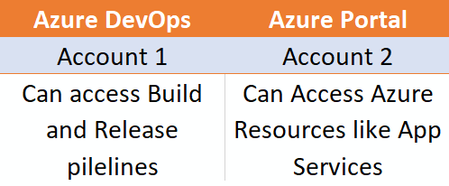
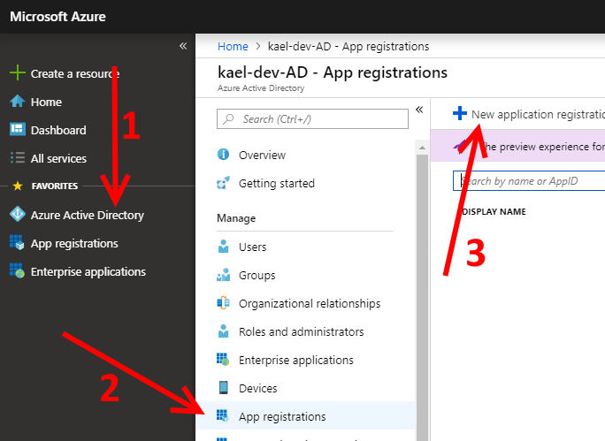
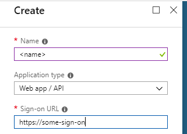
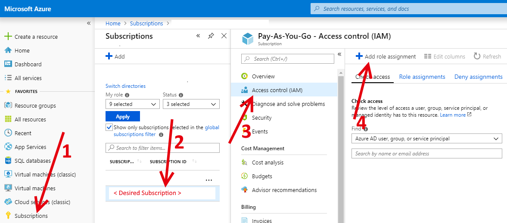
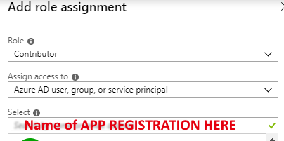
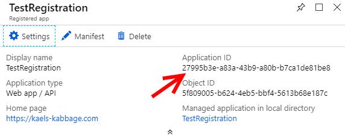
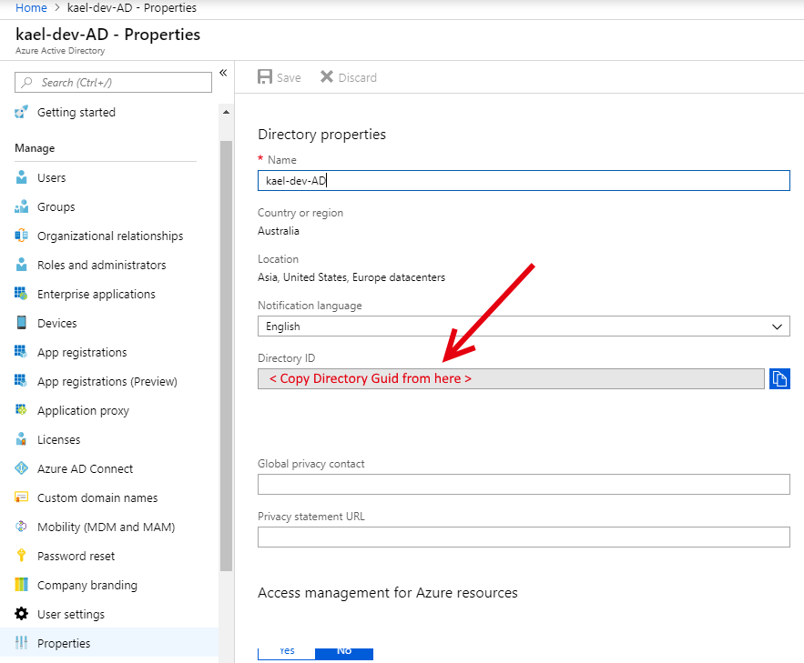
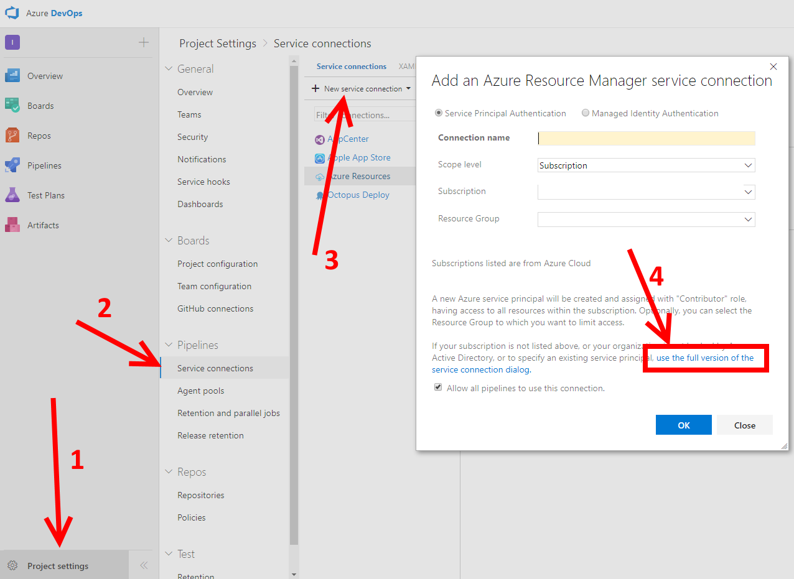
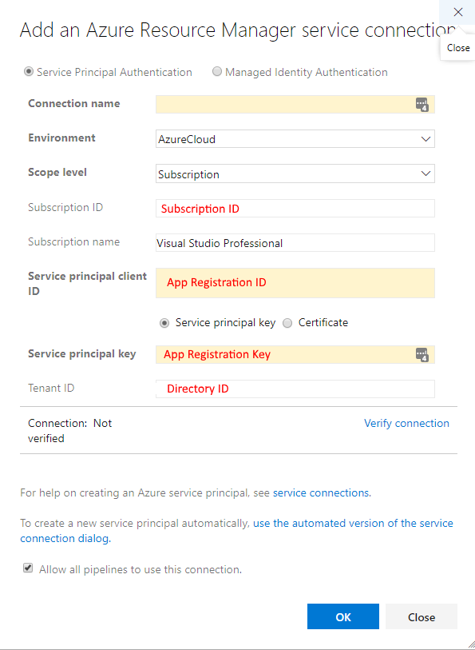

I was recently setting up a build pipeline in Azure DevOps and realised I didn't have access to the Azure resources to be able to pick the app service as a deployment target.  
The easy way would be to get my account access to the Azure resources, but:  

1. I'd be the only one with the ability to change those deployment options, or at least new devs would to get access as well before they could.  
2. The onsite guy for that kind of access was away.  

<!--more-->  

I had access to an account that had Azure resource access, so there had to be a way to use it in the pipeline somehow.  
Turns out there is, and it's via the [Azure Service Connections](https://docs.microsoft.com/en-us/azure/devops/pipelines/library/service-endpoints?view=azure-devops). 
Most of this is based off [this tutorial](https://docs.microsoft.com/en-us/azure/active-directory/develop/howto-create-service-principal-portal) from Microsoft.  

They use applications and service principals and the like to connect to Azure Resources (or a [multitide](https://docs.microsoft.com/en-us/azure/devops/pipelines/library/service-endpoints?view=azure-devops#common-service-connection-types) of other services like Github), and provide them for Pipeline access.  

So to illustrate the situation:  
  

Starting with the **Azure Portal account**, let's create an app registration to represent our connection to Azure AD.  
 
 

Then we need to assign that registration to the subscription containing the resources we want via Access Control.
 
 

That's the basic plumbing. There's security and stuff that can be added at those various steps (e.g. who's allowed to access the app registration, etc), but that's all I needed.   

Now we need to get some bits that Azure DevOps needs to make the link.  
 
 

Now using the **Azure DevOps account** in Azure DevOps:
  

NOTE the slight catch here is that we need to go to the advanced view in order to specify the app registration we created.
 

And that's done! Now your pipelines can access the Azure resources.  