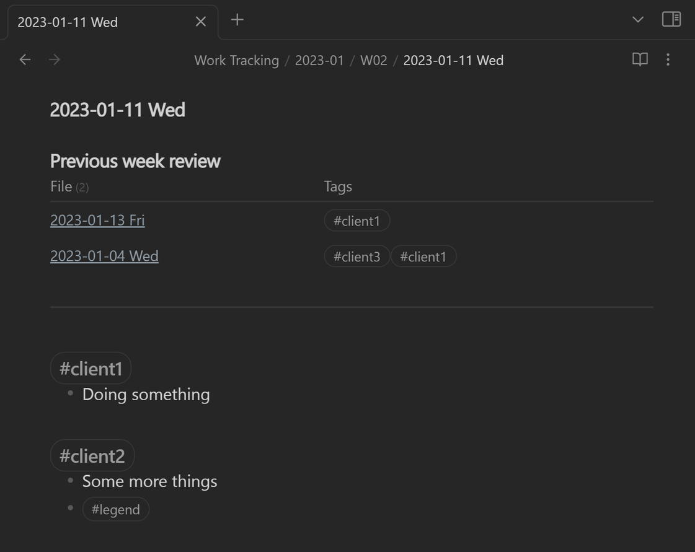
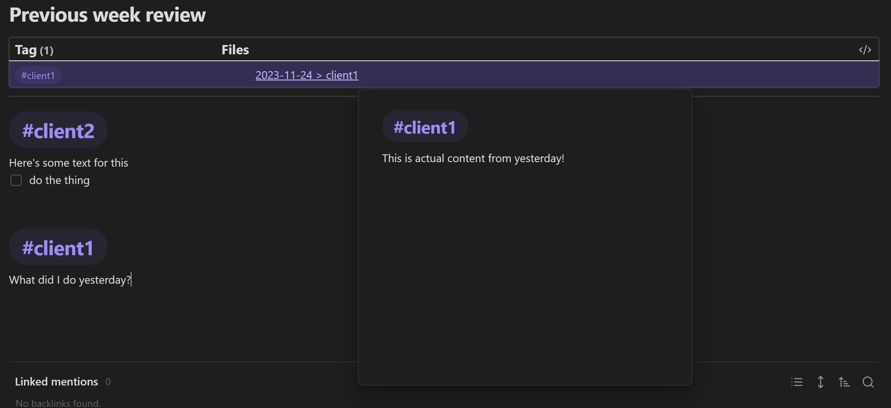

I've been playing with [Obsidian](https://obsidian.md/) over the last few months, and aside from some minor UI changes (via CSS) it's been pretty good!  
However, I found that I wanted to see what I was up to last week in the context of what I'm doing today.  
Here's how I did it.

<!--more-->  

EDIT 24-11-23: What I had wasn't working for me, so I've [tweaked it](#summary-view-v3).

My primary use of Obsidian is taking notes through the week. In general, I do work for different customers each day of the week, and I find that I've forgotten what I was doing last week, OR I did some work for that client on a different day than normal.  
I thought it'd be nice to have some way of summarising the last week of work to remind me.  

# Dataview  
Obsidian has a plugin called [Dataview](https://github.com/blacksmithgu/obsidian-dataview) which exposes a Javascript API and allows querying and advanced data visualisations over your notes.  
You can do basic stuff of the SQL vein like `table file from "incident"` which shows all your notes where you had an `#incident` tag.  
There is also a much more advanced Javascript implementation allowing you to add arbitrary code to get what you want.  

# Summary View V1
My first go at the summary view uses the SQL approach.
Essentially, I ask it to get me a list of the files from the last 7 days which have occurrences of the tags in the current page in them.  

e.g. The current page has `#incident` from above, so my summary would show any other files in the last week that have that tag.  

```sql
--```dataview
table file.tags as Tags 
where file.ctime > (this.file.ctime - dur(1 week)) and (file.ctime < this.file.ctime) and any(file.tags, (x) => contains(this.file.tags, x))
--```
```

However, you might notice an issue: It only gets 7 days back. For Monday, this is fine as it'll get the whole week prior, but for Friday, it'll only get back to Friday...
That's not quite what I want.

# Summary View V2
I had to delve into JS to achieve what I wanted here, as I couldn't find another way of extracting and comparing the dates with the start of their weeks, etc

```js
//dataviewjs
let fileDate = dv.date(dv.current().file.name.split(" ")[0])
let startOfWeek = fileDate?.startOf('week')
let fileTags = dv.current().file.tags

let mySource = dv.pages().filter(x => {
  const d = dv.date(x.file.name.split(" ")[0])
  if (!d || x.file.name === dv.current().file.name) return false
  const dStartOfWeek =  d.startOf('week')
  const diff = startOfWeek - dStartOfWeek
  const withinDateRange = diff >= 0 && diff <= dv.duration('7 days')
  const hasMatchingTags = x.file.tags.some(t => fileTags.includes(t))
  return withinDateRange && hasMatchingTags
}).map(x => [x.file.link, x.file.tags])

dv.table(['File', 'Tags'], mySource)
```

# The Result


---

# Summary View V3  
The above ended up not being as useful to me as I thought.  
It made it difficult to figure out what changes were actually present for the tags.  
It showed me what files had the tags in it, but not exposing the content.  

Now, I've tweaked it so it now shows the tags first, then the sections of their files related to the tags (because they're a level 1 heading)  

Let's see if this one works better 😎

```js
//dataviewjs
let fileDate = dv.date(dv.current().file.name.split(" ")[0])
let startOfWeek = fileDate?.startOf('week')
let fileTags = dv.current().file.tags

let matchingFiles = dv.pages().filter(x => {
  const d = dv.date(x.file.name.split(" ")[0])
  if (!d || x.file.name === dv.current().file.name) return false
  const dStartOfWeek =  d.startOf('week')
  const diff = startOfWeek - dStartOfWeek
  const withinDateRange = diff >= 0 && diff <= dv.duration('7 days')
  const hasMatchingTags = x.file.tags.some(t => fileTags.includes(t))
  return withinDateRange && hasMatchingTags
})

const flattened = matchingFiles.flatMap(x => x.file.tags.filter(t => fileTags.includes(t)).map(t => ({tag: t, link: {...x.file.link, subpath: t}})))
const grouped = flattened.groupBy(x => x.tag)
const filesAndTags = grouped.map(x => {
	const sorted = x.rows.sort(t => t.link.path)
	const cleanLinks = sorted.map(t => ({ subpath: t.link.subpath, path: t.link.path.replace('Work Tracking/', '').replace('.md', '') }))
	const strings = cleanLinks.map(t => `[[${t.path}${t.subpath}]]`)
	return [x.key, strings]
})

dv.table(['Tag', 'Files'], filesAndTags)
```

## Result  

