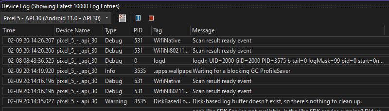
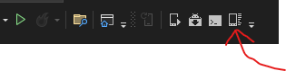
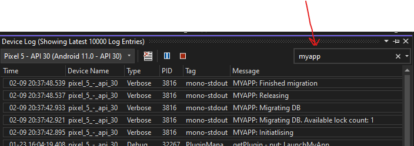

In my spelunking with [Android Foreground Services](/content/posts/2023-02-08-android-foreground-services/index.md), I needed to do debugging, and since I'm in Xamarin Forms, I used built in Visual Studio tools.

<!--more-->  

Android writes out to a debug log, and the main tool for viewing it is [logcat](https://developer.android.com/studio/command-line/logcat).
But...I don't want to use an external tool if I can avoid it, so Visual Studio provides a view of the logs.

Opening the Device Log while an emulator or Device is connected, you'll see loads of logs whizzing past.  
The whole device is logging there, so in my app, I put a known tag or message for easier identification.

# Custom Log Options
1) Works anywhere, but no tag: `Console.WriteLine("MYAPP: Some message")`  
2) Only works in Android Project, but has tag: `Android.Util.Log.Debug("MYAPP", "Some message")`  

This example is from the first option, note the Tag is `mono-stdout`, whereas the second option would have shown `MYAPP`.  
