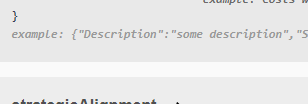
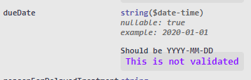

Swagger is a useful tool to describe your API and how it behaves.  
OpenAPI is the standard which describes what tools like Swagger should expose.  
I wanted my Azure Function to show an `example` on my properties, something the spec indicates is allowed, but I could not do it easily with the dotnet tools ☹️

<!--more-->  

Apparently there's two ways of doing Swagger/OpenAPI docs for dotnet.  
The first/old way is with `services.UseSwaggerGen` and customise through the config there.  
You're also able to indicate you want XML comments through that configuration.  
This method appears to be primarily for aspnetcore applications, and not for Azure functions.  

The second/new way is with Azure Functions OpenAPI Extensions.

# Azure Functions OpenAPI Extensions
I followed [the official](https://github.com/Azure/azure-functions-openapi-extension) Azure Functions openapi docs, which uses attributes to display the information (no XML comment support).  
I started using the other attributes like `OpenApiProperty(Description = "My property")`, `FunctionName(nameof(MyFunction))`, `OpenApiIgnore`, etc, and expected to be able to do something like: `[OpenApiExample("my property description")]` for examples.  

However apparently that attribute only works like this:
```cs
[OpenApiExample(typeof(MyExample))]
public class SomeClass 
{
  public string Property {get;set;} 
  ...
}

public class MyExample : OpenApiExample<DateTime>
{
    public override IOpenApiExample<DateTime> Build(NamingStrategy namingStrategy = null)
    {
        this.Examples.Add(OpenApiExampleResolver.Resolve("dateTimeValue1", DateTime.Parse("2021-01-01"), namingStrategy));
        this.Examples.Add(OpenApiExampleResolver.Resolve("dateTimeValue2", DateTime.Parse("2021-01-01T12:34:56Z"), namingStrategy));
        return this;
    }
}
```

That's far more effort per property than I'd want.  
Further, it also annotates the whole class instead of the individual property.  
It formats quite strangely for me as well, but I'm sure that can be fixed as well, but I don't want any of that!  









  

I MUST be missing something, it can't be that there's no simple way of adding that `example` to properties.  
I pulled the code and looked, and I can't find anywhere that sets the `example` attribute on the properties though, so I feel like it's just an oversight.  

# Crazy workaround   
There are some features we can hook into, but I found the documentation quite difficult to understand.  
From what I can figure out, the only hook into the output we have access to is `DocumentFilters` which can be set using the config.
```cs
internal class OpenApiConfigurationOptions : DefaultOpenApiConfigurationOptions
{
  public override List<IDocumentFilter> DocumentFilters => base.DocumentFilters.Concat(new[] { new SillyDocumentFilter() }).ToList();
}
```

Document filters come into the picture AFTER the document generation.  
As such, we don't actually have access to the types or attributes or anything from within, so how can I apply the attribute effects after it's all been generated?    

I created an attribute to represent a simple example for properties:
```cs
[AttributeUsage(AttributeTargets.Property)]
public class OpenApiExample_SimpleAttribute : Attribute
{
    public OpenApiExample_SimpleAttribute(string example)
    {
        Example = example;
    }

    public string Example { get; set; }
}

// Usage
[OpenApiExample_Simple("Here is a description")]
public string SomeProperty {get;set;}
```

Then I implemented my own document filter to go over all the models/schemas and find their actual types via reflection, then find their custom attributes and their values and populate the Example attribute manually.

```cs
public class SillyDocumentFilter : IDocumentFilter
{
    public void Apply(IHttpRequestDataObject req, OpenApiDocument document)
    {
        var schemas = document.Components.Schemas;

        // Schemas are the models
        // Reflect over the models, find the one that matches the schema name
        // Reflect over it's properties and look for the custom attribute and it's value
        // Add the property
        // IT'S TRASH!!

        var modelNames = schemas.Select(x => x.Key).ToList();

        var allTypes = typeof(SillyDocumentFilter).Assembly.GetExportedTypes();
        var filtered = allTypes.Where(x => modelNames.Any(m => string.Equals(x.Name, m, StringComparison.OrdinalIgnoreCase)));

        for(var i =0;i<schemas.Count;i++)
        {
            var schema = schemas.ElementAt(i);
            var matchingType = allTypes.FirstOrDefault(x => string.Equals(x.Name, schema.Key, StringComparison.OrdinalIgnoreCase));
            var properties = matchingType.GetProperties();

            AugmentWithExamples(document, schema, properties);
        }
    }

    private static void AugmentWithExamples(OpenApiDocument document, KeyValuePair<string, OpenApiSchema> schema, PropertyInfo[] properties)
    {
        var examples = properties
                            .Select(x => new { x.Name, Example = x.GetCustomAttributes().SingleOrDefault(a => a.GetType() == typeof(OpenApiExample_SimpleAttribute)) })
                            .Where(x => x.Example != null)
                            .ToList();

        for (var j = 0; j < examples.Count; j++)
        {
            var property = examples[j];
            var example = (property.Example as OpenApiExample_SimpleAttribute).Example;

            var value = document.Components.Schemas[schema.Key].Properties.First(x => string.Equals(x.Key, property.Name, StringComparison.OrdinalIgnoreCase));
            value.Value.Example = new OpenApiString(example);
        }
    }
}
```

It works, but it's so disgusting that I have to be missing something ☹️  
If you know how to do this better, I'd love to hear it, but until then, this is how I'll do it.  