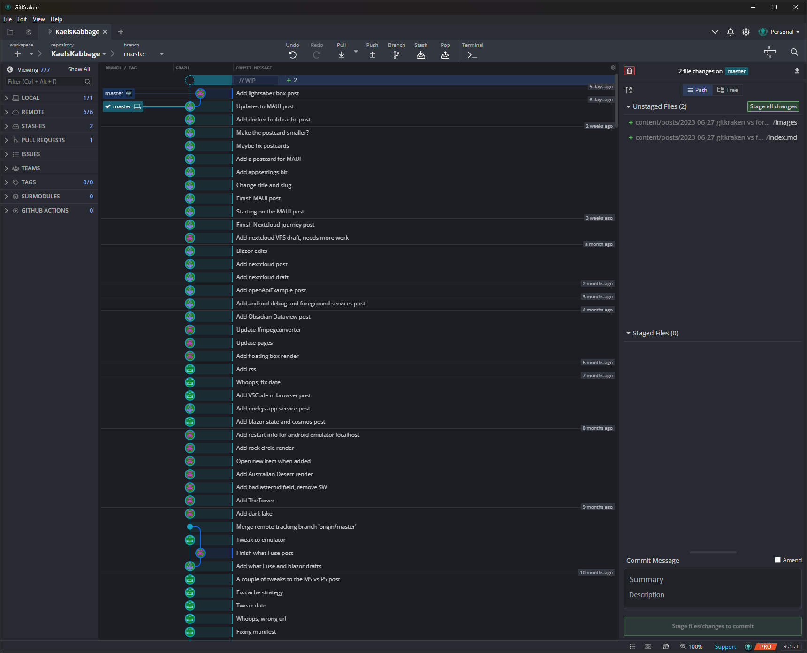
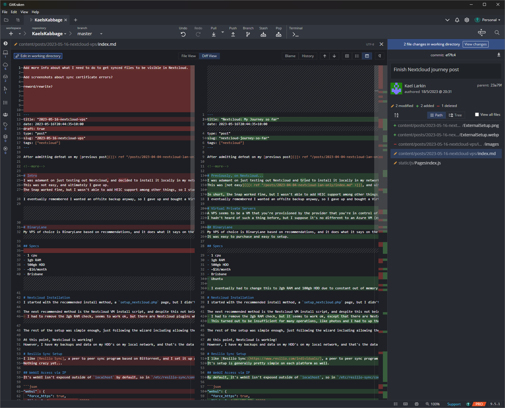

I've tried almost all the major git clients out there, and these two are the main ones that stuck with me.  
Tower and Sourcetree just didn't jive with me, Git Extensions...I really hated, even VSCode and Visual Studio git are fine in a pinch.  
I started with Gitkraken, moved to Fork because it was cheaper and I wanted to try something new, so after a year, how do they compare?

<!--more-->  

The differences aren't significant between Gitkraken and Fork, but something FEELS different.  
I don't know whether I can put words to it, but that's what I'm going to try.  
They're both great either way.  



# The Facts   

{}
{}
  

<!-- silly fix for markdown rendering inside other shortcodes -->
  

[Fork](https://git-fork.com/)

## Facts
- $50 one-off
- Windows, Mac

## Pros
- Fast  
- Closer to Git (shows actual git results and info etc)
- Easy access to all the common things
- Good keyboard support
- Uses GCM  

## Cons
- Not super flashy
- Can't set defaults for things like pull rebase, force push, etc



{}

<!-- silly fix for markdown rendering inside other shortcodes -->


[Gitkraken](https://www.gitkraken.com/)  

## Facts
- $60/year  
- Windows, Mac, Linux

## Pros
- Flashy
- Loads of integrations built in
- Nice defaults and helpful suggestions (do you want to force push?)
- Sexy git graph

## Cons
- Slower than Fork
- No GCM ☹️
- Yearly subscription instead of one-off payment  



 

Let's take a closer look at some facts.  
> **Disclaimer**  
> *Gitkraken* was my first real git client  
> *Fork* is my current client

|  | Fork | Gitkraken |
|----|----|----|
| Performance | 🏎️ | 🚗 (not *slow* just not as fast) |
| Sensible defaults | More like Git, asks questions | Sensible defaults |
| *e.g. Pulling* | Modal with options like "Force" | Single button, rebase by default (I think) |
| *e.g. Pushing with upstream changes* | Fails with Git output, needed to tick box in modal | Fails but asks if you want to Force Push |
| Graph | Inlines branch/tag with commit message, shows SHA and commit time | Branch/tag pulls out to left, hides commit time a little |
| Profiles (separate creds and behaviour) | Yes | Yes |
| Tabs support | Across top | Across top |
| Search/filtering | Yes | Yes |

## Diff  
They both have similar features, although I'd say Gitkrakens is slightly better, better syntax highlighting, better support for entire file view, etc.  

{}
  




{}


  

## Commits and branches  
| | Fork | Gitkraken |
|---|---|---|
| Rebase features | Good keyboard shortcuts | Easy reword, drop, reorder, etc |
| | `Ctrl + Enter` to commit staged, `Ctrl + Shift + Enter` to commit and push | |
| Create branch | `Ctrl + B` on a branch | Right click --> Create |
| Stashing | Asks for name and asks if you want to delete when applying | One click stash/pop, requires manual rename and manual apply only |
| Worktrees | No ☹️ | No ☹️ |

## Integrations  
| | Fork | Gitkraken |
|---|---|---|
| Git Credential Manager | Yes 😀 | No 😭 oauth, PAT's, etc |
| Github | Shows some info about PR's, etc | Extensive integrations (issues, PR's, etc) |
| Azure | No | Yes |
| Other | No? | Yes, many more integrations |

## Other features  

{}
{}  

- Allows opening the system default terminal  
- Has a button that allows opening any detected sln in Visual Studio, the whole repo in VSCode, and the Azure Devops url in the default browser

{}
{}

- Has it's own Workspaces feature allowing a custom board and whatnot for teams, etc  
- Has a custom terminal with additional git features  

{}
{}  

---

# The Feels  
Sometimes it doesn't matter what the tool does, it's more about how it feels.  

Reading all the above "facts", it feels like I'm leaning towards Gitkraken, and to some extent I am.  
It's defaults fit my workflow quite well, and SOMETHING about it just feels a bit nicer.  
Perhaps it's the fact that the defaults and flows mean I get less prompts, and if I set something that ISN'T a default, it's NOT remembered.  

That sounds like the correct behaviour, but recently in Fork I ticked "Remove stash after applying" and moved on, but it was remembered the next time which I didn't want.  
That said...Gitkraken auto-deletes it...  

The UI differences are there but they're not significant, and yet I **feel** like Gitkraken is a bit nicer. Crisper.  
Perhaps it's just bias.  

Gitkraken is leaning into some distinguishing features like it's Terminal, Workspaces, and other integrations which is nice BUT I don't care as much about that as I do some other things like:  
- Performance  
- GCM support  

Fork is massively almost overwhelmingly superior in both of these aspects.  
Integrations are great, but it doesn't feel worth juggling PAT's to make it work.  
To be fair, Gitkraken isn't really slow, it's slower than Fork.  

> Another disclaimer  
> I did have some issues with Gitkakens one-button oauth solution and submitted a bug.  
> It's just not something they're focussing on at this stage (I have a slightly unusual setup)  

# Conclusion?  

**TL;DR FACTS**  
- Fork = Great  
- Gitkraken = Great  
- Fork is faster and supports GCM
- Gitkraken has vastly superior integrations  

**TL;DR FEELINGS**  
- GCM is too good to give up  
- Performance is a pretty nice feature  
- Juggling commits is better in Gitkraken  
- Integrations are getter in Gitkraken
- BUT...  
  - I don't think it's a good enough trade-off yet  

e.g. Being able to do something weird like drop or reorder a single commit without fussing with a rebase, or quickly reword the commit message is just...nice.  

Clearly I'm still conflicted about this, as such, I'm going to use the easiest one which is Fork for now.  