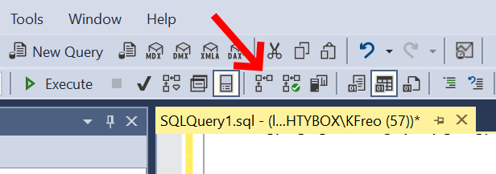
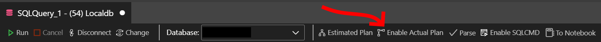
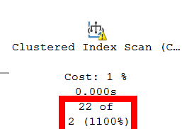
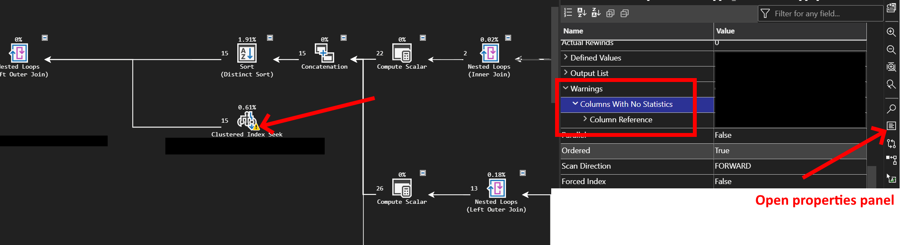
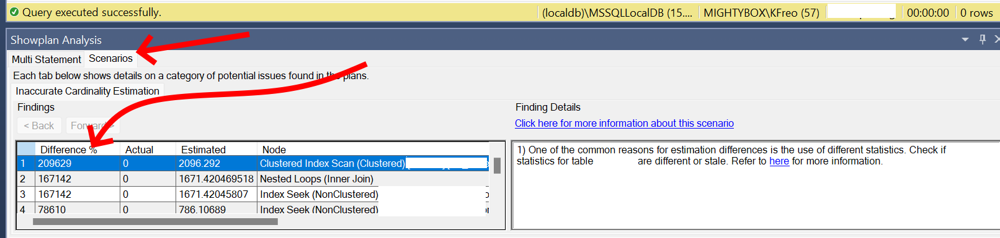

Databases are magic black boxes that we developers use all the time, but rarely really understand.  
Sure, we *could* understand them, but:  


So what can we mere lazy mortals do when SQL Server databases misbehave?  

<!--more-->  

> Disclaimer: I'm not an expert, take the below with a grain of salt and measure measure **measure**!  

{}  

I've written about [database performance investigations before](/content/posts/24-sql-perf-chasing/index.md), but this is a more general set of tips.  

# Check the query execution plan  
For the luckily uninitiated, SQL Server parses your query and ~~makes a pact with Cthulhu~~ determines how best to execute it.  
The result is an execution plan, which it can often reuse so it doesn't have to do it next time.

Each element of a plan indicates a step the database takes and it keeps track of how long each step took and how much work it had to do.  

To investigate execution plans using [SSMS](https://learn.microsoft.com/en-us/sql/ssms/download-sql-server-management-studio-ssms?view=sql-server-ver16) or [Azure Data Studio](https://azure.microsoft.com/en-au/products/data-studio):  

1. Enable "actual execution plan" (the "estimated" plan is a guess, and can be used if required, but try to get the actual.)  
2. Run the query (ideally the exact query as it is executed in Prod from debug logs or whatever you use)  
3. Look through the plan for expensive operations

### Getting the Actual Execution Plan

{}
{}


{}


  

> Plans read right to left, bottom to top, i.e. the top left item is the last thing the database server does before returning your data.  

Finding expensive operations sounds easy, but even when you do, how do you fix them?

## What to look for  

> In brief, because I don't know much more.  

- **Table scan:** The DB is looking through the whole table. That's slow.  
- **Index scan:** The DB is looking through an index. That's much faster, but still not as fast as it could be (Index seek).  
- **Parallelism:** Little orange icons with arrows in the query plan mean the DB can do data fetching and processing in parallel. This is usually faster, but many things can prevent parallelism (e.g. user defined functions)  
- **Excessive memory grant:** Little orange exclamations in the query plan indicate warnings. This one is usually where it got more rows than expected for one or more of the steps. This is usually a statistics problem.  
- **Missing statistics:** Related to the above, you can try running statistics `sp_updatestats` or manually generating them in SSMS.  
- **Some steps working with way more rows than expected:** These two are hard, but if the right side of the plan is processing millions of rows, but ultimately the left returns two rows, it might be worth trying to alter the query to limit the right side rows.  
- **Many more rows in the result-set than expected:** Similar to above, if the left is returning loads of near duplicate rows, it's worth reconsidering your query, possibly splitting it or filtering in other places.  

{}
{}  
  
{}  
{}  
  
{}  
{}  

## Analyse query plan  
Right click anywhere on the plan and select "Analyse query plan".  
The only analysis I've been able to get it to show is "inaccurate cardinality" which is where the database is guessing wrong a lot, and is usually missing or outdated statistics.  
Statistics are even more magic than the rest of this to me, so I just run `exec sp_updatestats`.  
I suspect this isn't wise to run in Production without some planned downtime.  



# Check on missing indexes  
Indexes can make a massive difference to performance.  
They're essentially a smaller table built off the larger table specifically for performance.  

Sometimes when running a query in SSMS, you'll get a green box with "Missing Index:" and a `create index...` script.  
It would be a terrible idea to copy paste that, give it a proper name, and run it on the database...  
So after you do that, performance should improve for that query, but not always.  
Sometimes the database doesn't have any more idea than you do and won't suggest an index, and this is all if you have an idea **which** query is a problem.  
I sure don't want to check every query in my app this way, can't the database just tell us what the problem is?    

Well yes!  
The following query is one I ~~stole from several places~~ cooked up myself and shows the top 20 recommended missing indexes recommended by Our Lord Cthulhu.  

```sql
SELECT TOP 20
    CONVERT (varchar(30), getdate(), 126) AS runtime,
    CONVERT (decimal (28, 1), 
        migs.avg_total_user_cost * migs.avg_user_impact * (migs.user_seeks + migs.user_scans) 
        ) AS estimated_improvement,
    'CREATE INDEX missing_index_' + 
        CONVERT (varchar, mig.index_group_handle) + '_' + 
        CONVERT (varchar, mid.index_handle) + ' ON ' + 
        mid.statement + ' (' + ISNULL (mid.equality_columns, '') + 
        CASE
            WHEN mid.equality_columns IS NOT NULL
            AND mid.inequality_columns IS NOT NULL THEN ','
            ELSE ''
        END + ISNULL (mid.inequality_columns, '') + ')' + 
        ISNULL (' INCLUDE (' + mid.included_columns + ')', '') AS create_index_statement
FROM sys.dm_db_missing_index_groups mig
JOIN sys.dm_db_missing_index_group_stats migs ON 
    migs.group_handle = mig.index_group_handle
JOIN sys.dm_db_missing_index_details mid ON 
    mig.index_handle = mid.index_handle
ORDER BY estimated_improvement DESC;
GO
```

# Parameter sniffing  
My understanding is limited here, but when a query plan is built, it uses the statistics (which is why stale stats can be a problem) and the parameters that are going to be substituted into the plan e.g. `DECLARE @__minDate_0 datetime2 = '2023-02-01T00:00:00.0000000'.  

The DB attempts to guess based on those stats and parameters how much data is going to be processed at each stage, and if it guesses wrong about what those parameters look like, it can work fine for some parameters and awfully for others.  

I can safely say I don't know how to fix this properly, except by using `OPTION (RECOMPILE)` which builds a very general plan which tends to balance ok BUT will rebuild it each time, which **can** be terrible for performance.  

Identifying whether you have this issue is a guess for me too, but I look for when you have a query performing poorly in Prod, but very well in SSMS.  
e.g. Prod takes 50 seconds, SSMS takes 0.1 seconds (over similar data)  

# Compatibility level?  
SQL Server has pretty good backwards compatibility, and exposes it via [compatibility levels](https://learn.microsoft.com/en-us/sql/relational-databases/databases/view-or-change-the-compatibility-level-of-a-database?view=sql-server-ver16).  
You can have SQL Server 2022 installed but make the database behave as if it was 2012, which is very useful for moving databases or upgrading infrastructure.  
There can be performance benefits to upping compatibility levels, in recent times around parallelism.  

It's a long shot, but as long as you're not using advanced SQL Server features, it's worth a go.  

You can mess with your compatibility level using the below, and here's a [list](https://learn.microsoft.com/en-us/sql/t-sql/statements/alter-database-transact-sql-compatibility-level?view=sql-server-ver16#compatibility_level--160--150--140--130--120--110--100--90--80-) of the compatibility levels. 

```sql
-- Find out what it is
SELECT compatibility_level  
FROM sys.databases where name = 'YOUR DB NAME'

-- Change it
ALTER DATABASE YOUR_DB_NAME  
SET COMPATIBILITY_LEVEL = 160; 
```

# Summary  
Every time I think I understand what databases do and how they do it, I find something else out.  
Figuring out where to target your performance investigation is a struggle, and I hope these tips provide a reasonable starting point.  

So...
Can databases be tamed? Can your sql performance woes be solved?  
Sometimes, but have a care weary traveller, ye stand atop a mighty precipice where all fear to tread.  
And if you should survive with your mind intact, kudos, cos I clearly haven't.  