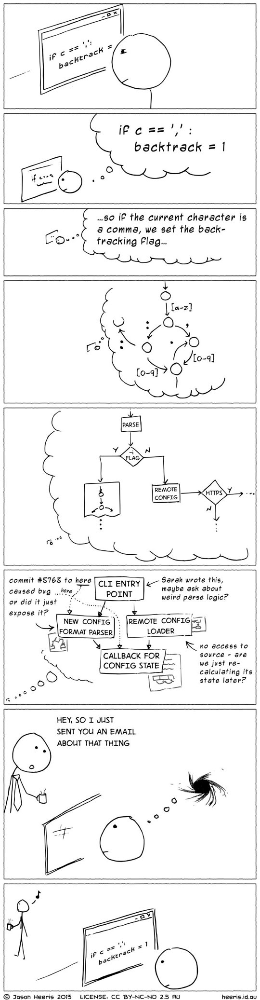
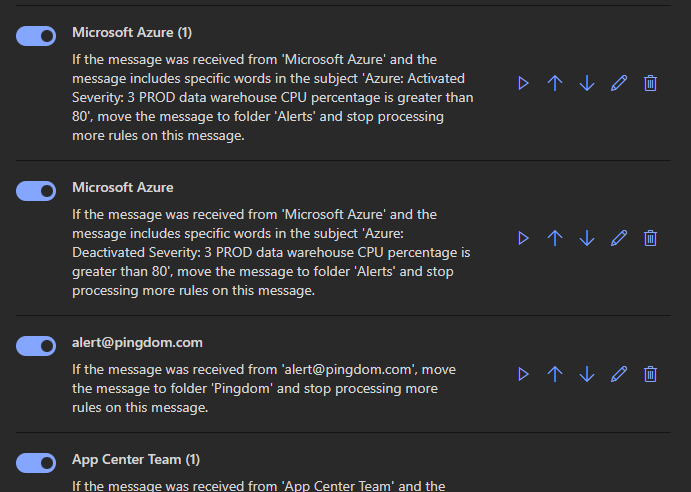
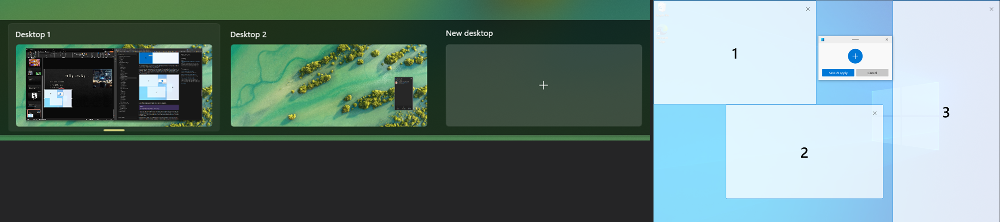
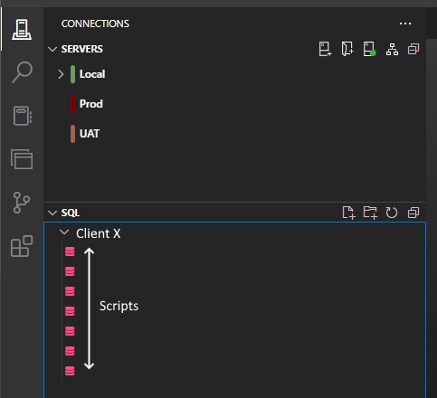
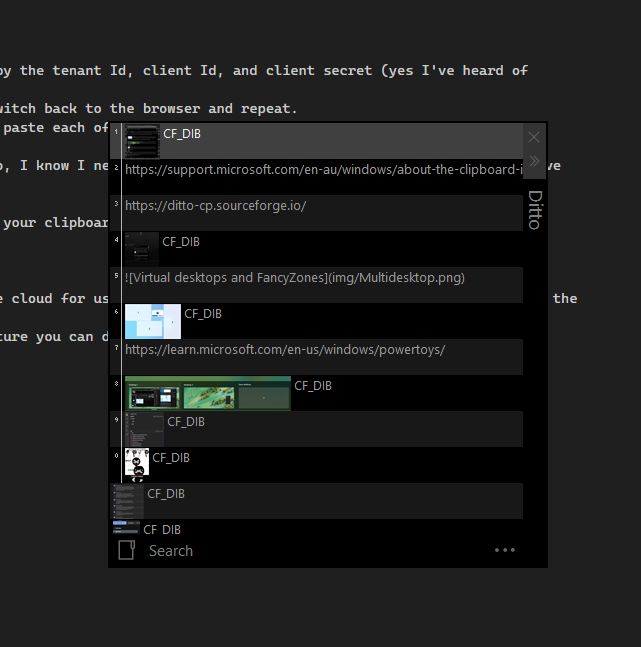
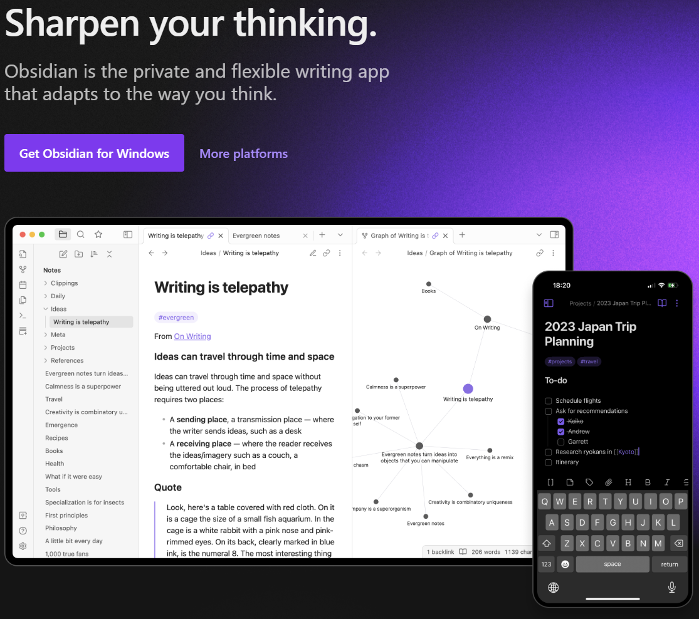

I feel like the world is getting more and more hectic.  
You have to sign up to everything (who then send you emails), there's an app for everything too (which ping you at every opportunity) and more and more, I find my attention fragmented.  

Here's some methods/ideas/ramblings that you've definitely heard before that I'm trying to use to keep my focus, prevent context switching, and keep myself productive.  

<!--more-->  

  

# Disruptions  
You're digging into a problem, it's got something to do with this handler running at the same time as this other handler when you have this particular filtering enabled...etc...Then, an email comes in, Teams pings, and/or a coworker pops over to talk, aaaand gone...



I'm quite a lazy person, I don't want to have to train myself to do something complicated or use complex tools to improve this.  
Fortunately for us lazy people, laziness can be trainable in lazy ways 😂

> [!CAUTION] Disclaimer! 
> These are tips/methods I think are useful, I have no empirical evidence, I just believe these are useful.  
> Also, these are things I'm *trying* to do, not necessarily successfully doing.   

This is also very common stuff, I haven't come up with any of this myself.  
I just like reiteration and reinforcement.   

I've talked about this [kind](/content/posts/2022-08-08-what-i-use/index.md) of thing [before](/content/posts/15-vs-vscode-tips-and-tricks/index.md), but only in pieces, this is in a bit more detail. 

# Habit Stacking  
When you have a new habit you want to establish, you can "stack" it in with an existing habit to reduce cognitive load.  
Two tasks become one like "When I'm waiting for the coffee to boil, I'll un/stack the dishwasher".  
I've had mixed success with this in software consulting though.  
The main success I've had has been tacking things onto the end of checking emails, like checking logs at the same time, beginning my daily note, etc.  

This is possibly more related to:  

# Chunking  
Grouping tasks together to preserve context context, e.g. handle all your emails then move onto the next task, OR handle one email and dive deep into that issue (like investigation into production issue or whatever).  
This helps keep focus on the task instead of jumping around.

## Just do it  
Related to the above "if a task will only take 5 minutes, just do it".  
It's not worth the context switch of writing it on your todo list and coming back to it later.  

<div class="tenor-gif-embed" data-postid="9226712" data-share-method="host" data-aspect-ratio="1.33523" data-width="50%"><a href="https://tenor.com/view/shia-la-beouf-just-do-it-motivation-gif-9226712">Shia La Beouf Just Do It GIF</a>from <a href="https://tenor.com/search/shia+la+beouf-gifs">Just Do It!</a></div> <script type="text/javascript" async src="https://tenor.com/embed.js"></script>

# Email Rules  


Your email inbox is a big bucket for **anyone** in the world with your address to pour things into.  
You can control what happens when an email comes in, filter it into a new box that **you** control.  
Have a folder per client, one for PR comments, one for marketing emails, etc  

Auto-delete emails you know you never want (or unsubscribe), and have a folder where you can pipe internal company comms (you almost never need them, but sometimes you might need to look back at one)  

You can then mark folders as Favourites which moves them to the top of the window, making it easier to see those folders you care about.  
My inbox is a cesspool that I rarely look at, all the important stuff is moved to those folders.  


One thing I usually want is any email from a certain domain to go to a folder (all emails from anyone at *client X*)  
There's a condition called "Message Header Includes" where you can add any text, e.g. `@clientX.com`.  
There can also be multiple entries in that field, e.g. *client X* has a third party with an email domain `@thirdparty.com`, you can add them to this list as well so you only have one rule called "Filter to Client X".  

A major downside to email rules, at least in Outlook, is the rules manager is so bad.  
There's no searching, the new Outlook client has only recently received the ability to resize the window (I swear the old one couldn't do it either), it's just not a fun experience right now.  

> This may be one of the most important takeaways: Setup email rules, they're so useful.

## Communications Priority Control  
This is a really hard one to control in a reasonable way, but I always tell my clients that email is for non-critical comms.  
I'll get to them when I can, but even if you mark it as **!Important!**, I may not see it until later in the day.  
If it's urgent, call/sms me.  

It's hard if you don't want to give out your number or don't have a work number you can give out, but I find it beneficial to prevent misunderstandings.  

# Do Not Disturb/Zen/Focus  
Once you've ticked off all the urgent tasks and you're ready to sink into something: 


All major operating systems have the idea of a DND/Focus mode which suppresses notifications (at least most of them, looking at you Teams).  
This is great for preventing interruptions by apps pinging in the background, but sometimes you want to allow one communications stream for urgent requests.  
Usually you can mark certain apps as important and they're allowed through.  

Set a DND/Focus session for 15-30 minutes and get stuck into stuff, then resurface afterwards, reevaluate priority and progress, and repeat.  
Related to this is Zen mode which is an app-level feature where the superfluous structure of the app is hidden.  
Browsers have F11 to go fullscreen and hide the chrome, VSCode and Visual Studio have Zen mode to hide chrome and (sometimes) maximise only the code area.  

# Multiple Monitors/Workspaces/Virtual Desktops  


This goes back to the chunking idea of colocating(cotemporal?) work or information.  
Multiple monitors allow you to lean on your spatial awareness to quickly identify where something is, workspaces/virtual desktops allow grouping related windows away from the distractions of the others.  

I always have Youtube/Spotify and Slack on one monitor, so I always know where those are but also where everything else isn't.  
I then can have a virtual desktop for *client X* with my VS and VSCode windows open and probably a browser, and another desktop with *Client Y*'s code and browser.  
My git client and email would be marked as "Show on all desktops" so I always had them when needed.  

A very related idea is to have your scripts centralised, not off in their own folders per client/project.  
I have one folder where all my linqpad scripts live, one folder where my SQL scripts live, etc, and I open that folder in the tool.  
I used to have a folder for client/project X, and another for Y, but then it's hard to remember which you have open when you open the tool.  
It's obvious but it took me a while 😅



[Powertoys](https://learn.microsoft.com/en-us/windows/powertoys/) FancyZones allows splitting your desktop up into areas that you can control and even pin apps to zones so they always open there.  
I think this is similar to the multi-monitor idea, where you can lean on spatial awareness to locate information.  

> There are a bunch of really handy tools in Powertoys, I strongly recommend checking it out.

# Clipboard History  


[Windows](https://support.microsoft.com/en-au/windows/about-the-clipboard-in-windows-c436501e-985d-1c8d-97ea-fe46ddf338c6#:~:text=To%20get%20to%20your%20clipboard,item%20from%20your%20clipboard%20menu.) has clipboard history built in (Win + V)!  
I believe MacOS does as well, but Linux doesn't have a great answer here.  
I use [Ditto](https://ditto-cp.sourceforge.io/) by force of habit.  

Clipboard history is good for preserving context as it tends to popup at the mouse or caret location so you don't have to flick back and forth when copy pasting.  

An example: You're creating a new app registration and you need to copy the tenant Id, client Id, and client secret (yes I've heard of Managed Identity, it's just an example).  
I always see colleagues copy the tenantId, switch to vscode, paste, switch back to the browser and repeat.  
The way I do it now is, copy all the things I need, switch to vscode, paste each of them.  

I find this reduces my cognitive load of what I have to remember to do, I know I need these three things, I'll just copy them now and move on, I know they're in my clipboard when I need them.  

It also removes that worry of accidentally losing whatever you had on your clipboard.  

> This is another big takeaway, use clipboard history, it's so good!

There's also cloud clipboard where your clipboard can be synced to the cloud for use on other devices, but I'm not a big fan of this for the built in ones. Microsoft is probably peeking!  
Also, Apple is way better at this than Windows, there's that cool gesture you can do over your machines to copy and paste!  


# Reduce Local Dev feedback loop  
This could definitely be grouped with something somewhere about shortening feedback loops to prevent focus breaks while waiting for something to happen, but I couldn't figure out where else to put it.  

I have an auth service that is really annoying to log into (VPN, long signin process and short lived tokens) so I tend to either disable auth entirely, or add a different mechanism like my own AAD or a local identity server.  

Sometimes a client has complex views and stored procs that make local dev slow, so I tend to add dumb caching at the controller level where I just capture one set of results and return them until the process restarts.  
This is great for when I'm doing UI changes, but UI changes trigger page refreshes (Angular!!!!) and I don't want to wait 5 seconds for the database.  

In C#:

```cs
// Just have: services.AddMemoryCache();

// Then:
app.Map("/api/slowrequest", (context, [FromServices] IHandler someHandler, [FromServices] IMemoryCache cache) => {
    // The key 'testing' is not supposed to change, this code should NEVER reach Production
    return await cache.GetOrCreateAsync("testing", async (entry) => {
        var results = await someHandler.Execute();
        entry.SetValue(results);  // Is this actually necessary? I'm never sure...
        return results;
    });
});
```

# Note Taking  


Disruptions are inevitable, so taking notes is a good way to reduce the impact of disruptions.

I take notes in daily notes (as in "here's what I did today") so I can refer back when the client says "you did it on Monday", which is great for jotting down all your notes for the day to return to later.  
Many note taking tools have the ability to recall partial notes from other places to collate them in another note.  
e.g. I have [Obsidian](https://obsidian.md/) set up to show me any unticked checkboxes from the last 2 weeks at the top of every note so each day, I see items that I've been meaning to do, but haven't necessarily gotten to for whatever reason. It's dynamic, so once I do tick it off, it's gone from that top section.  

I also like to link notes together for long running tasks, e.g. I'm investigating a performance issue at *client X* but I don't get it done that day, so I note it all down in a non-daily note, link that note to the daily, and come back to it tomorrow, linking each daily note to the long running one.  
That can get unwieldy if it's long enough, so you can also link directly to headings, so I create a heading per day in the long running note.  
That way, I still know what I learned each day, but I can just read down the one note to figure out where the task is up to as a whole.  

Another thing I do is write notes in code directly. This is especially useful for the original problem at the top where you're way deep into something and you've narrowed the problem down to *something here* but you don't know what yet, and you get a call from the client.  
I'll quickly jot down what I'm thinking at the time into the code (in a breaking way so I can't forget it) and then answer the call.  
This way, when I'm back into it, I know where the issue is and what I was thinking when I was last there.  

[Onenote](https://www.onenote.com), [Notion](https://www.notion.so/), [Obsidian](https://obsidian.md/), [Logseq](https://logseq.com/), whichever works for you.  


# Honorable mentions  
Some other things:
- Find a fast file searcher (I use [Everything](https://www.voidtools.com/))  
  - Aint nobody got time to wonder where a file is.
- Use a better launcher than Windows Start Menu  .
  - Start is somewhat disruptive to use, has loads of things you probably don't want, but are in your face.
  - I use [Powertoys Run](https://learn.microsoft.com/en-us/windows/powertoys/run), but there's [Listary](https://www.listary.com/) as well.
- Chatgippity  
  - AI is pretty useful sometimes.
- Keyboard and mouse shortcuts are so useful. Why use the mouse to do something you can do with the keyboard?

# Key takeaways  
- Email rules help organise this most common of communication methods.  
- Clipboard history is fantastic.  
- Prevent disruptions and keep focus with DND/Focus modes.  