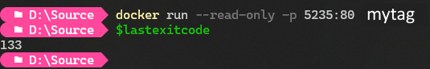

While running apps in containers with the likes of Docker and Podman, the cloud can add additional complexity to this.   
This is particularly relevant when control of the container environment is not in your hands.  

This is a little story about debugging a container issue in AWS and some of the interesting things I learned out of it.  

<!--more-->  

## Error code 133  
Client X, upon deploying a new version of my code where "not much changed", discovered that the containers in ECS were failing to start with no logging of any kind through Cloudwatch or the direct log streams from ECS.  
The only information we had was that "An essential container exited" and an error code of 133.  
Googling this revealed little, especially since we weren't sure whether the code was from my app, Docker, or AWS itself.  
A vibe we got from this googling was that it was somehow a permission issue.  
"Not much changed" was obviously a red flag for them and asked me to figure out what it was.  

## The changes  
My changes weren't significant, several nuget updates and some logging updates.  
Surely none of that could prevent a container from starting at all? The app, sure if the logging wasn't configured correctly, but we'd get something in Cloudwatch from that.  
Well I had a sneaking suspicion that despite the minor version upgrade, it was something to do with IronPDF, as we've had permissions issues in the past.

## IronPDF and it's directories  
[IronPDF](https://ironpdf.com) is a fantastic library for handling PDF's in various languages, and I'm almost certain that this issue is actually my poor configuration.  
This story is more about the debugging process of this issue, as it lead me to some interesting places.  
There is a page on [temp file paths](https://ironpdf.com/how-to/linux/#temp-file-paths), however I couldn't get it to work.  

## Docker readonly environment  
Due to security requirements, Client X was using `--read-only` when running up the container in ECS, which causes the container filesystem to be readonly, and we thought this could be the cause.  
Upon disabling it, the container came up immediately, success!  
Now...what directory were we trying to use 🤔

## Some neat debugging skillz  
Client X has far more knowledge in Linux and AWS debugging than I do, and suggested looking at the container filesystem to find the most recently modified directories.  
It seems obvious in retrospect!  
It's also at this point that I realised it *could* be replicated locally using similar docker commands, otherwise I was stuck reading over their shoulder.  

## Docker readonly  
`docker run --read-only mytag` runs the container with the filesystem set to readonly, just as it was running in Client X's environment.  
The command immediately returns with the exit code `133`.  



Replicated!  
Now how do I find the edited directories in a sensible way?  

## Finding those pesky directories  
Running the container and just looking with `ls -alt` in `/` *did* show some modified directories, but how much of that was related to the container startup and how much for the app? How do I know that those are 100% required?  
> `a` for all files/directories including hidden ones that start with `.`  
> `l` for "lots of info", not sure what it's official name is, but it shows more info  
> `t` sort by timestamps, default most recent at top

I ended up starting the container without starting the app itself, waiting for a while to make sure it was my app that was going to be changing directories, then running it up and looking again.  

```bash
docker run --entrypoint='/bin/bash' mytag
# Launches into bash bypassing the original entrypoint which was the app
# Wait here a bit so timestamp differences become obvious
cd /appdirectory
dotnet app.dll
ctrl + c # Kill app after starting, don't need it anymore
cd /
ls -alt
# The top directories will be the ones touched by the app starting
```

In my case, I could see a few directories being touched (`root`, `tmp`, `app`), so now how can I determine which ones **must not** be readonly?  

## Tmpfs  
Docker can mount filesystems from host into container, including docker managed filesystems.  
Docker managed volumes are generally persistent, just managed by docker.  
Tmpfs is a RAM only filesystem destroyed when the container exits, and is perfect for ephemeral info, which is exactly what this this experiment needs!  

```bash
docker run --read-only --mount type=tmpfs,destination=/tmp,rw=true --mount type=tmpfs,destination=/root,rw=true mytag
# --read-only makes entire filesystem readonly
# --mount... mounts a ram only filesystem at /tmp inside the container
# rw=true makes it readwrite (readonly by default)
```

## It all works out in the end  
Using this method, I mounted all the directories that were touched as tmpfs mounts and ran up the container... 🤞  
It started!!  

From there, I could pare it back and find the specific directories that were absolutely required to launch the container.  
In this case, the main one was `/root` for some reason.  It looks like there's a `config` directory in there must have something important.  

## Final thoughts  
I wasn't even aware that the container filesystem could be made readonly, let alone that it can be considered best practice.  
I'm not sure how you'd be able to do any damage from there, unless you had host mounts or something?   
It's something I've added to my list of interesting things to read up on.  

I'm also looking into changing the test suite to make the container filesystem readonly to catch this in the future.  