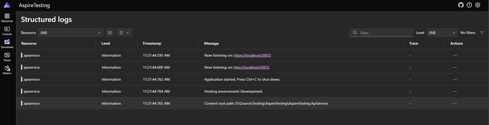

I was halfway through writing this when some guy called David Fowler [beat me to the punch](https://medium.com/@davidfowl/model-run-ship-the-new-way-to-build-distributed-apps-48d67286a665)  

---

When Aspire was released, I created a project and thought the automatic logs and metrics were cool, but left it alone since I had other ways of getting that info.  
I think this was a mistake.  

<!--more-->  

# What is Aspire  


In my own words, [Aspire](https://learn.microsoft.com/en-us/dotnet/aspire/get-started/aspire-overview) is a high level orchestration and multi project configuration mechanism.  
It helps wire projects together and adds a bunch of nice defaults for free, but isn't required for the running of said projects and doesn't lock you in.  
It's cross platform, easy to add to existing projects, and has many plugins to support services.  

When adding it (the standard way) you get `AppHost` and `ServiceDefaults` projects.  AppHost is a web project that is the orchestrator and injects the generated configuration into the various projects, and ServiceDefaults holds standard configurations for projects (like OTEL config, standard web settings, etc)  


At the end, you get this:  

# How is it more than just a dashboard, and why should I care?  
While the above dashboard is useful and informative, I think the best part of Aspire is its orchestration.  

Instead of a docker compose file, or a Readme full of instructions on how to setup dependencies and relations between projects, you define them in Aspire and let it do the work.  
New devs don't have to be bogged down with setup, or confused around what services are where, they just F5 and they can see how it all links together.   

It can stay local only too, with production config being specified in the usual appsettings.json and .env files (discussed more later).  
I believe this should be standard for any greenfields project in the dotnet ecosystem.  
What about existing projects, and is it really worth doing outside toy projects and demos?    



# All smoke, no fire?  
  

> Still a toy demo... but hopefully it's a more realistic one given the types of apps I work with.  

Let's see how Aspire might fit into an example of an existing project.  
What changes need to be made?  

## Hypothetical existing project setup  
- SQL server  
- aspnetcore backend  
- React frontend  

Other existing projects in the wild tend to have: 
- Seq for logging  
- Maybe Jaeger or something for traces  
- Probably no metrics  
But I'm not adding them here for brevity.  

## The "old" way of working  
Normally around here, development on such a stack goes something like this:  
- Install/pull Sql Server, Seq, etc
- F5 Visual Studio or Rider  
- `npm ci && npm start` in VSCode (or F5 if that's set up)  

Aspire can define the connectivity and configuration of those items in code and just F5 in VS to get the whole lot running.  

My slightly silly realistic demo is setup thusly:  
- One table in DB with some fields  
- aspnetcore minimal api with EFCore code first  
- `npm create vite@latest -- --template react-ts` with a `fetch` to get data from the api  

It spans the whole stack and ensures we can run and connect to each area.  

> The key is that Aspire isn't really "doing" anything, it's almost a GUI over appsettings.json and docker compose (except that it doesn't generate them).  

# Dev experience  
It's much the same from a dev perspective, we still get hot reload in Vite and dotnet, we get logs, etc.  
This way, it's all managed in one place.  


If you don't want to run in the orchesration for some reason, you can fairly easily pull it apart.  
You can't directly tell Aspire to only run a subset of services, but you can comment them out, or just run each project the normal way.  
The configuration that Aspire does is injected during execution, but can be provided through appsettings.json and other config sources as well.  

> Aspire host will override appsettings.json connection strings because they're injected as environment variables  

# Production???  
> Disclaimer: I haven't actually got one running in Prod...  

As mentioned above, having configuration in appsettings.json seems to be the easiest way to get things running in Prod.  
Aspire just having control over the local execution.  

Just don't forget to update any config changes in Aspire AND appsettings.json if necessary   

# Conclusion  
Dashboards are nice, especially when they're free, but the orchestration magic that Aspire has makes it very nice to pick up as a new dev to a project.  
I have Aspirations (😅) to add it to all my existing projects.  


Although...is this the one true best feature of Aspire?


---

# Remaining questions/investigations required  
- It can also be configured to publish a dockerfile when required within code, but I haven't really tried that.  
- Integration testing packages look like they make testcontainers obsolete.  

---

[Demo project github](https://github.com/KFreon/AspireTesting)  

Some tldr copy pastes  

```cs
// AppHost program.cs
var builder = DistributedApplication.CreateBuilder(args);

// Can also do builder.AddConnectionString without the sql + db step to use an existing database.

// Build sql container called "thedatabase" containing a database called "mydatabase"
var sql = builder.AddSqlServer("thedatabase")
    //.WithImageTag("2019-latest") // Allows easily changing the desired image
    .WithLifetime(ContainerLifetime.Persistent); // will not destroy "thedatabase" container on exit. Should reuse any existing container with that name.
var db = sql.AddDatabase("mydatabase");

var apiService = builder.AddProject<Projects.AspireTesting_ApiService>("apiservice")
    .WithReference(db) // Inject connection string from db reference
    .WaitFor(db);  // wait for it's health checks to be healthy

// Spin up the UI project (uses CommunityToolkit)
var ui = builder.AddNpmApp("frontend", "../client", scriptName: "dev") // Run `npm run dev` in the ../client directory
    .WithNpmPackageInstallation() // Do npm install
    .WithHttpEndpoint(env: "VITE_PORT")  // Add an env var called "VITE_PORT" and set it to some random port (used to config vite proxy in vite.config.ts)
    .WithEnvironment("VITE_BACKEND_URL", apiService.GetEndpoint("http"))  // Get the http endpoint of apiService and set that env var to it's value
    .WithExternalHttpEndpoints() // Allow external access (outside containers, allows host access)
    .WaitFor(apiService);

builder.Build().Run();
```

```cs
// Api program.cs
var builder = WebApplication.CreateBuilder(args);

// Add service defaults & Aspire client integrations.
builder.AddServiceDefaults();

// This gets a connection string called "mydatabase" from config
// If using the Aspire host orchestration, adding "addSql" and "adddatabase" will create this config
// If not, having a connectionstring called "mydatabase" will be picked up
builder.AddSqlServerDbContext<MyDbContext>("mydatabase");

var app = builder.Build();

// Omitted for brevity...

app.Run();
```