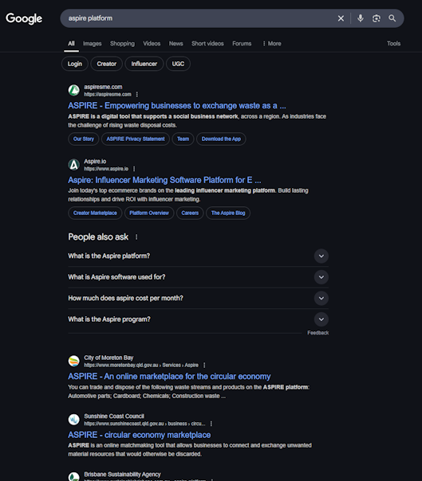

I was halfway through writing this when some guy called David Fowler [beat me to the punch](https://medium.com/@davidfowl/model-run-ship-the-new-way-to-build-distributed-apps-48d67286a665)  

When Aspire was released, I created a project, went "cool, easy metrics and logs but I have better options" and left it alone.  
I think this is a mistake.  

<!--more-->  

How many of us did that? Spin up an Aspire project to look at the pretty graphs and OTEL spans?  
It can be more than that, more useful, more complex, moar.  

# What is Aspire  
[Aspire](https://learn.microsoft.com/en-us/dotnet/aspire/get-started/aspire-overview) is a poor name to google...  

In my own words, Aspire is a high level orchestration and multi project configuration mechanism.  
That is, it helps wire projects together and adds a bunch of nice defaults for free.  
It's cross platform and easy to add to existing projects.  

> Not going into how to add it, except that it's easy.

# Why should you care?  

# How is it more than just a dashboard?

That's all nice locally, but how does it deploy? How can I actually use it in the real world?

# Locally nice! How does it actually run in the wild?  
Generate docker and compose?

> Some nice screenshots and stuff.