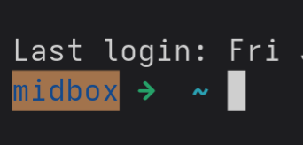

My basic Linux prompt setup, since I've lost it several times now...

<!--more-->  

Using [zsh](https://www.zsh.org/) and [oh my zsh](https://ohmyz.sh/) for pretty and functional prompts.  

Using the basic robbyrussel theme for everything. 


```bash {title="~/.zshrc"}
# Plugins
plugins=(
	git
	zsh-autosuggestions
)

# History setup
HISTFILE=~/.zsh_history
HISTSIZE=10000
SAVEHIST=10000
```

## Show ssh host in prompt

```bash {title="In theme config (robbyrussel in this case)"}
# %K is background
# %F is foreground
# Resetting them both at the end
if [[ -n "$SSH_CONNECTION" ]]; then
  HOST_DISPLAY="%K{yellow}%F{blue}%m%f%k "
else
  HOST_DISPLAY=""
fi

PROMPT="${HOST_DISPLAY}%(?:%{$fg_bold[green]%}%1{➜%} :%{$fg_bold[red]%}%1{➜%} ) %{$fg[cyan]%}%c%{$reset_color%}"
PROMPT+=' $(git_prompt_info)'

ZSH_THEME_GIT_PROMPT_PREFIX="%{$fg_bold[blue]%}git:(%{$fg[red]%}"
ZSH_THEME_GIT_PROMPT_SUFFIX="%{$reset_color%} "
ZSH_THEME_GIT_PROMPT_DIRTY="%{$fg[blue]%}) %{$fg[yellow]%}%1{✗%}"
ZSH_THEME_GIT_PROMPT_CLEAN="%{$fg[blue]%})"
```

