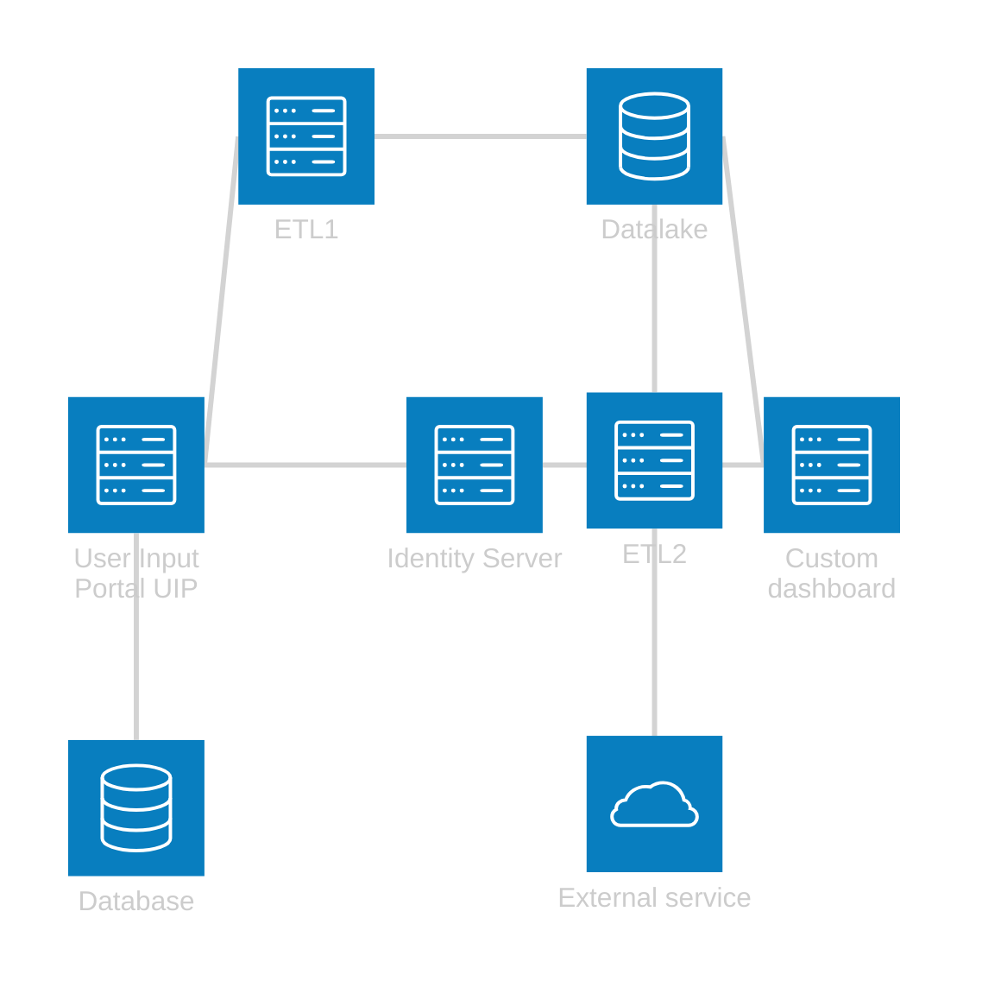
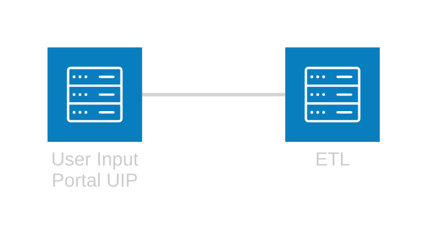
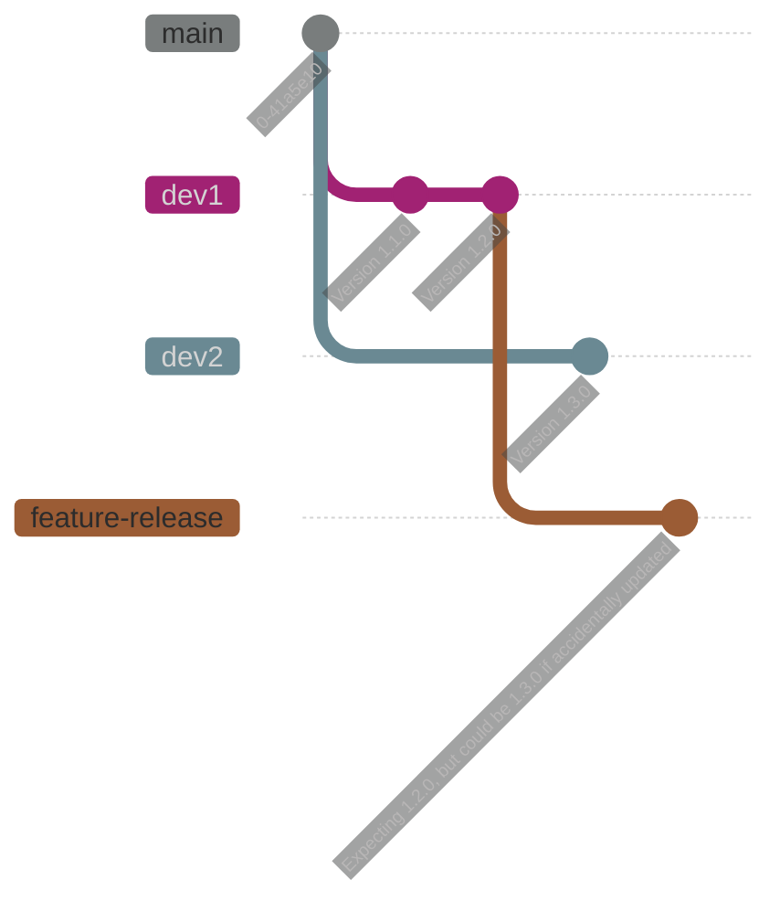
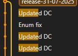
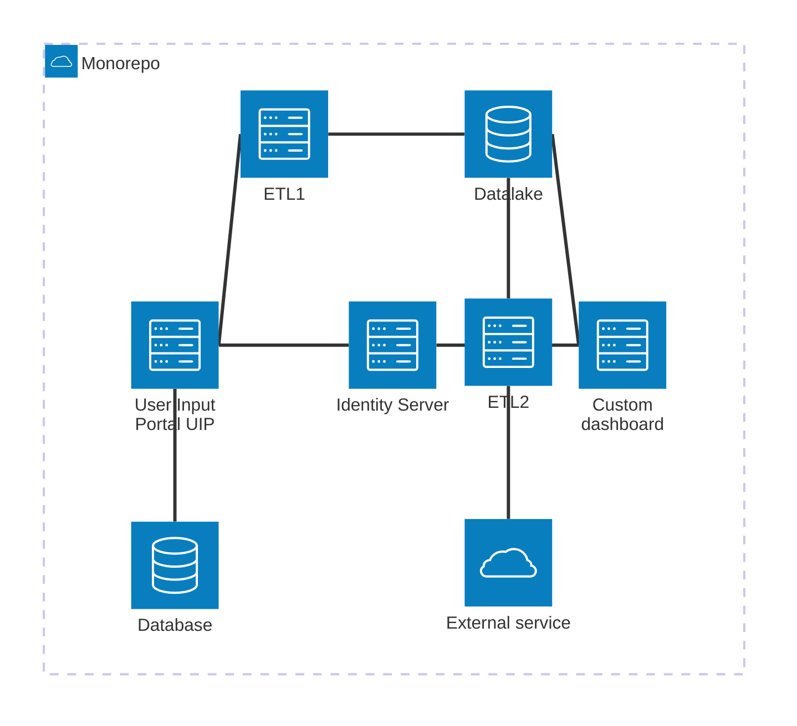

I've been working on some clients who have a bunch of sites, Azure functions, and whatnot (microservices, but not so micro) and each one is it's own git repo.  
They started off with limited data sharing and intercommunication, but over time this interdependency increases, now I'm asking why these apps are different apps in the first place.  
Changes that ripple through them are difficult to do, track, and maintain, so what options do I have?  
Well I went down this road of three options, let's see how it's turned out.  

<!--more-->  

# Why coupled? Coupling bad!  
Coupling indeed bad (although `it depends`), but I'm going to try and explain myself and my decisions and in doing so, learn something about git, coupling services, and perhaps myself.  

# Setup  

The loose contracts between these apps were handled manually, and changes made in the UIP database would have to be manually copied over to the other projects if required.  

> The ETL process might be strange too, I'm not sure how common it is to have an Azure function that does it's ETL by calling the API for the data using those contracts...
> It feels kinds nice, but also leads to this stronger coupling.  

After some discussions with my colleagues, it seems likely that this was more of a distributed monolith as opposed to microservices...  
I don't have great exposure to either setup.  

Before we go on, let's just simplify that diagram above for later use.  
We'll focus on the interaction between two services and how the coupling there worked.  
Just note that these contracts were used in many of those other projects too.  

## Simplified setup for future use  

# What's wrong with loose contracts?  
In this case, the coupling was high enough that it was both tedious and error prone.  
Also, at the time, there were some team changes occurring, and a team member forgot to add a property to the ETL datacontract (and DbContext) leading to the Test ETL process failing.  
PR's help catch these incidents, but it still felt like an unnecessary risk in this day and age (circa 2018)  

Refactoring becomes difficult to maintain, with no built-in way of preventing contracts getting out of date.  

What follows is how we've worked with it over the last 5+ years to try and improve the situation (in chronological order)  

> I'm certain there are strategies around these challenges, but these are what I went with instead.   

# First attempt: Shared nuget package  
The idea is:
- Extract and distill both sides of the contracts into their own project  
- Publish this project as a nuget package during CI (on internal feed)
- Reference nuget in related projects

**Pros:**   
- Easy to setup   
- Flexible enough  

**Cons:**  
- Versioning becomes ridiculous, especially with multiple branches  
- Difficulties reasoning about which version is which  

## Versioning is hard  
The versioning was just 1.x.x and we could manually update the major version, and the minor would tick along as the build number.  

This can lead to the following scenario where the latest build is the latest version of the shared contracts.  
In this scenario, each commit is pushed up to the CI pipeline where it builds and creates a new nuget package.  

It also means that when I see `version 2.3.0` what does it mean? Which branch was it?  

This is almost certainly the laziest and least useful method of versioning in this scenario, but I couldn't figure out a better way a the time.  
Local dev was pretty frustrating, as you'd build, push, wait, update nuget, and continue working.  

## Rebuild and redeploy required but not enforced  
While this his is technically a requirement for all options, here there was no physical or mental trigger to enforce it.  
Sometimes we'd just forget to trigger the build for that project.  

I wanted to try and ensure that we couldn't just *forget*.  

# Second attempt: Git Submodules  
[Git submodules](https://github.blog/open-source/git/working-with-submodules/) are a way of embedding one repo into another.  
I figured it was a low friction way of making it more difficult to forget changes, while improving the dev experience.  

Instead of just a project, the shared contracts were split out into their own repo, then made a submodule of the other projects for use.  

```mermaid
---
config:
  theme: 'dark'
---

architecture-beta
    service userinput(server)[User Input Portal UIP]
    service etl(server)[ETL]    
    service dc(s)[Datacontracts]

    userinput:R -- L:etl
    dc:T -- B:userinput
    dc:T -- B:etl
```

The dev flow was you'd make branches in the app repo and DataContracts submodule if required, then that branch could be shared across the multiple projects that needed it.  

**Pros:**  
- Easy to reason about (in isolation!)  
- Decent dev experience  

**Cons:**  
- Hard to reason (in general), lots of branches means things get confusing  
- Lots of git tools handle submodules, but often not trivially or completely (hard to know what exactly is checked out, auto fetches root repo, but not submoules, etc)  
- Commits can often be "update submodule" and nothign else, makes rebasing hard  

That above diagram looks simple, but in reality, it wasn't a shared project across different apps, it was a copy of that repo across those projects.  
You end up with `projectCount` copies of the DataContracts repo on your machine, each potentially with different branches going at once...  

## More realistic diagram  

```mermaid
---
config:
  theme: 'dark'
---

architecture-beta
    group uip(cloud)[UIP]
    group etlgroup(cloud)[ETL]

    service userinput(server)[User Input Portal UIP] in uip
    service etl(server)[ETL] in etlgroup
    service dc(s)[Datacontracts repo] 
    service uipdc(s)[UIP submodule] in uip
    service etldc(s)[ETL submodule] in etlgroup

    userinput:R -- L:etl
    uipdc:T -- B:userinput
    etldc:T -- B:etl
    uipdc:B -- T:dc
    etldc:B -- T:dc
```

In reality, 

This means that in practice you have `projectCount` copies of the DataContracts repo on your machine, each potentially with different branches going at once...  

## Reasoning with branches! 🤢  
As mentioned above, it can get confusing when you have three different DataContracts repos open for different apps, and you're trying to understand which bits are on what branches in order to support the various apps.  
My submodules wouldn't auto-fetch either, so sometimes I'd thing I was up to date on this repo, but I didn't have the latest changes.  
I'm bad with force pushing as well, so I think I made this harder for myself than it needed to be.  

## Commit message: Updated submodule  
When pulling in changes from other branches, we'd have lots of commits like: "Update submodule", or "Pull in changes from contracts"  
This was noisy but could be ignored, however it made rebasing super messy.  
There was almost always conflicts with the submodules (I assume simply because the commit hash is different?)  
As such, rebases almost always went: "Ignore any submodule changes and just set the submodule commit at the end", but then the commits don't work in isolation, and you have to stop to fix it every. single. commit.  

# Subtrees?  
[Git subtrees](https://www.atlassian.com/git/tutorials/git-subtree) are something I saw as similar to submodules, but I didn't end up testing them.  
It seems to be that it improves on submodules by handling changes more transparently than a commit pointer, but I didn't investigate.  

# Multirepo --> Monorepo  

But...[monorepo bad](https://medium.com/streamdal/mostly-terrible-the-monorepo-5db704f76bdb)?  
I needed to do something, and I couldn't see a way to fix what we had in a better way than any of the above.  
I concluded that a distributed monolith was worse than a monorepo monolith.  

**Pros:**  
- Simple, only one sln to build
- Can't be out of date between projects

**Cons:**  
- Big  
- Lots of entrypoints   
- "Need" to deploy all projects to make simple change in one project  

## How did I integrate them all?  
I broadly followed [this](https://gfscott.com/blog/merge-git-repos-and-keep-commit-history/) approach from Graham Scott.  
- In each repo, move everything into a subfolder named like itself (repo was called UIP, so move it all into `repo/UIP`)  
  - This way there's no merge conflicts when we smoosh everything together.  
  - Put these changes on their own branch e.g. `tech/monorepobranch`
- Create new git repo for everything to live  
- Add each repo to the list of monorepo remotes
  - `git remote add -f remotename ../remotesource`  
  - `../remotesource` is the path to the individual git repos, can be https:// paths.  
- Merge each repo into the big boi  
  - `git merge remotename/monorepobranch --allow-unrelated-histories`  
  - `--allow-unrelated-histories` keeps the history of the individual repos  
- Remove remotes  

## Simple changes in one site affects all?  
This was the sticking point that I had to ultimately overcome.  
Building and deploying all apps for a tiny text change in one of five sites is excessive, but it's avoids the common issue where one site has way more deployments than the others, and all the version numbers are different.  
That's common in these scenarios, but when things are coupled like this, and the client asks whether the current deployment has a change in it, I had to dig into multiple repos to find out what was where and why.  

One branch, one build, one deploy, one day later...(cos the build takes ages)  

## Rebuild entire build and release pipeline...  
This was another major sticking point.  
Moving to a new repo means consolidating and rebuilding the pipeline.  
While fun and good for cleaning the cruft out (looots of it too), it's riskier, more time consuming, and may not be something the client wants to pay for.  
Silver lining is that I now have some experience in yml pipelines!  

# What code is where  
I'm not sure where else to put this, but it's a big part of my life in Managed Services/Sustained Engineering.  
Let's say UIP was being developed much more than the ETL job, and it had 100 more deployments.  
Let's also say that the DataContracts were being changed for UIP and Admin, but not in a way that broke the ETL.  
e.g. I was adding properties to the contracts, but they weren't 100% required in the ETL job, but they were being used in the Admin app.  

Now the client asks "Ok so now we want the ETL job to use those, will that work?".  
I find figuring out where the ETL code is up to compared to the others regarding the shared contracts to be pretty hard.  
If not hard, at least time consuming, flicking back and forth between the repos and environments and trying to determine what changes are going to affect the ETL job in unexpected ways.  

In that example, it could be argued that we should have separate contracts for different apps.  
Fair, but I didn't want to; I believed they were conceptually the same, and should be represented by one entity.  

In this new monorepo world, is this better?  
I believe so, because there's one branch, one build, one deploy.  

# Conclusion: Which is best?  
The monorepo feels best for now, but perhaps this coupling that's been creeping in is more avoidable than I believe.  
Submodules might be ok when doing solo work or only a couple of repos, or if all of them were submoduled into one.  

It's going to be pretty hard to undo the monorepo, so most likely we'll stick with it.  