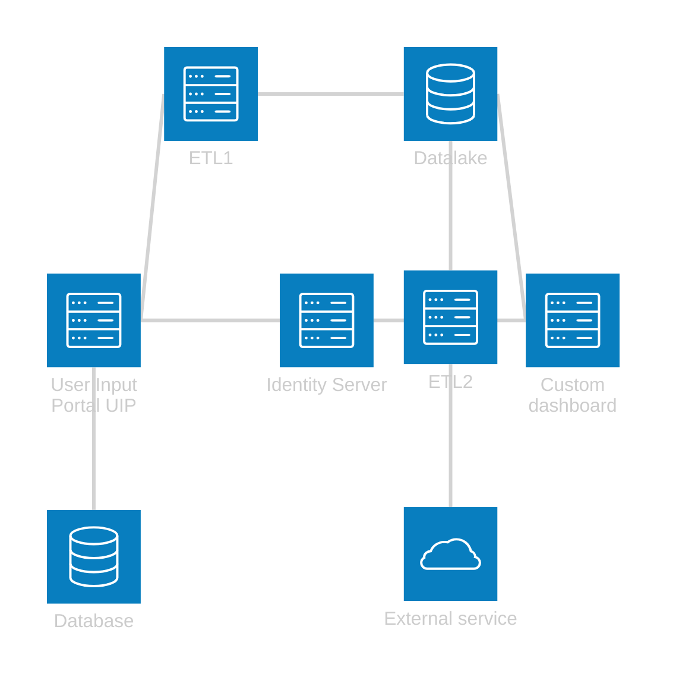
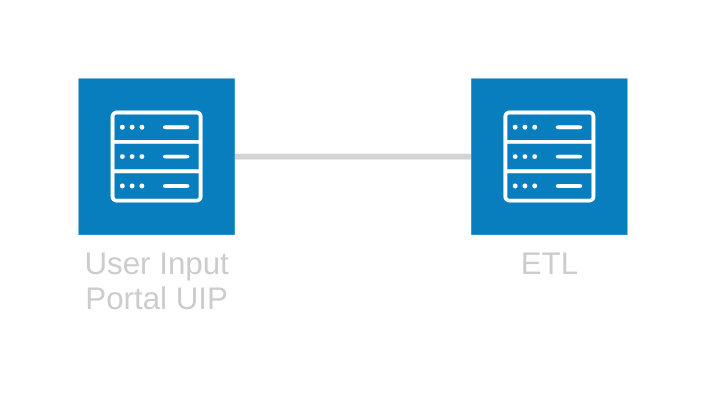

```mermaid
---
config:
  theme: 'dark'
---

architecture-beta
    service userinput(server)[User Input Portal UIP]
    service etl(server)[ETL]    
    service dc(s)[Datacontracts]

    userinput:R -- L:etl
    dc:T -- B:userinput
    dc:T -- B:etl
```

I don't work with microservices much, and I'm hesitant to call what I've been working on "microservices", but I have repeatedly come across the scenario where: client has multiple apps (loosly related) and they want them to talk.  
Over time, this talking increases, and sometimes becomes so much that we're now asking why these apps are different apps in the first place.  
Managing that coupling is tricky and I'm bad at it.  

<!--more-->  

# Why coupled? Coupling bad!  
Coupling indeed bad (although `it depends`), but I'm going to try and explain myself and my decisions, and in doing so, learn something about git, coupling services, and perhaps myself.  

## Setup  

These started as related but different projects in different git repos, and there were no explicit datacontracts between them.  

The loose contracts were handled manually, and when changing something in  the UIP database, we'd copy over the change to the other projects if required.  

> The ETL process might be strange too, I'm not sure how common it is to have an Azure function that does it's ETL by calling the API for the data using those contracts...
> It feels kinds nice, but also leads to this stronger coupling.  

Before we go on, let's just simplify that diagram above for later use.  
We'll focus on the interaction between two services and how the coupling there worked.  
Just note that these contracts were used in many of those other projects too.  

## Simplified setup for future use  

# What's wrong with that?  
Handling the datacontracts manually was both tedious and error prone. At the time, there were some team changes occurring, and a team member forgot to add a property to the ETL datacontract (and DbContext) leading to the Test ETL process failing.  
The crash as well as PR's help catch these incidents, but it still felt like an unnecessary risk in this day and age (2018 or something like that)  

It's also difficult to do a refactor, where changing the contracts is desired but then those changes need to be replicated to the other projects.  

So, what follows is how we've worked with it over the last 5+ years to try and improve the situation (in chronological order)

# First attempt: Shared nuget package    
We extracted the contracts that both projects use into it's own project which gets published as nuget package to private feed during CI.  
The other related projects would reference that nuget and thus the contracts are shared. 

**Pros:** Easy to setup  
**Cons:** Versioning becomes ridiculous, especially with multiple branches, hard to know what version it should be

## Versioning is hard  
The versioning was just 1.x.x and we could manually update the major version, and the minor would tick along as the build number.  

This can lead to the following scenario where the latest build is the latest version of the shared contracts.  

I'm 100% sure this was the laziest way of doing the versioning and I could have improved it, but I still felt it was clunky to have to do a build of one app in order to have the updated contracts in a different app.  
It made local dev frustrating, until we just referenced the project locally.    

## Rebuild and redeploy required  
This is technically a requirement for all options, BUT with the nuget approach, we could forget that it was needed at all.  

Sometimes we'd forget, as it was strange to think that we might have done a build, or need to do a build of one project that could affect another project.   

I wanted to try and ensure that we couldn't just *forget*.  

# Second: Git Submodules  
[Git submodules](https://github.blog/open-source/git/working-with-submodules/) are a way of embedding one repo into another.  
I figured it was a low friction way of making it more difficult to forget changes.  

I pulled the contracts into a new repo, then made that repo a submodule of the other projects for use.  
When using it, you'd make branches in your main repo, and if required in the data contracts repo, then pull those changes into both projects.  
The flow was that you'd pull the latest in the relevant branch of the data contracts repo for your work before PR merge.  

**Pros:** Easy to reason about (in isolation!)
**Cons:** Hard to reason (in general), lots of branches means things get confusing. Lots of git tools handle submodules, but often not trivially or completely (hard to know what exactly is checked out, auto fetches root repo, but not submoules, etc)
Commits can often be "update submodule" and nothign else, makes rebasing hard

That above diagram looks ok, but the reality was a little different.  

## More realistic diagram  

```mermaid
---
config:
  theme: 'dark'
---

architecture-beta
    group uip(cloud)[UIP]
    group etlgroup(cloud)[ETL]

    service userinput(server)[User Input Portal UIP] in uip
    service etl(server)[ETL] in etlgroup
    service dc(s)[Datacontracts repo] 
    service uipdc(s)[UIP submodule] in uip
    service etldc(s)[ETL submodule] in etlgroup

    userinput:R -- L:etl
    uipdc:T -- B:userinput
    etldc:T -- B:etl
    uipdc:B -- T:dc
    etldc:B -- T:dc
```

This means that in practice you have `projectCount` copies of the DataContracts repo on your machine, each potentially with different branches going at once...  

## Reasoning with branches! 🤢  
Initially, everything was fine with this setup.  
Things got complicated when we had multiple, long running, conflicting branches where we'd be unsure which version of the submodule was right during the merge, so we'd just pick one, then fixup the actual version with a new PR.  
It also made switching branches more complicated, as you have multiple repos to stash changes (if stashing is your thing)  

## Commit message: Updated submodule  
As mentioned above, we'd often (mistakenly or otherwise) have lots of commits like: "Update submodule", or "Pull in changes from contracts"  
This was noisy but worse, it made rebasing super messy.  
There was almost always conflicts with them because it can't track things, it's just a commit hash.  
It meant that it was easier to ignore all submodule changes until the end, set the submodule head, and commit that...every rebase.  
MESSY!  

## Tooling support is...technically there  
Everything supports it, but it's the degree.  
For example, the submodules don't seem to auto-fetch? It's probably just a setting I have wrong.  
Still, it means you have multiple repos open for the same project (which was the goal 🤔)

There's got to be a better way.  

# Subtrees?  
[Git subtrees](https://www.atlassian.com/git/tutorials/git-subtree) are something I saw as similar to submodules, but I didn't end up testing them.  
It seems to be that it improves on submodules by handling changes more transparently than a commit pointer, but I dunno.  

# Multirepo --> Monorepo  
But...[monorepo bad](https://medium.com/streamdal/mostly-terrible-the-monorepo-5db704f76bdb)?  
I needed to do something, and I couldn't see a way to fix what we had in a better way than any of the above.  
I concluded that the 5-6 repos we had were actually more coupled than it seemed, so I decided to just go with a monorepo.  

NOOO GIF

Pros: Simple, only one sln to build, can't be out of date between projects.
Cons: Big, lots of entrypoints, "need" to deploy all projects to make simple change in one project  

## How did I integrate them all?  

## Simple changes in one site affect all?  
Yeah, this was the sticking point that I ultimately overcame.  
Building and deploying all apps for a tiny text change in one of five sites is excessive, but it's also nice when someone asks "what code is where" and you can easily tell them.  
Right now, you have to open 5 projects and figure out where each is up to.  
One branch, one build, one deploy, one day later...(cos the build takes ages)  

XKCD fencing compiling gif? or skeleton or something

## Rebuild entire build and release pipeline...  

# Conclusion: Which is best?  
The monorepo is the newest so it's the best for now.  
Less flippantly, I do think that these projects are too coupled logically to risk having them separate.  
So for now, monorepo 4 lyfe but in the end, we'll see.  
It's going to be pretty hard to undo, so most likely we'll stick with it.  

other notes
- loose contracts in Managed services makes refactoring hard too
    what if you're doing a big smoosh of a couple of dtos/entities, you have to try and track those changes across into the dependent projects
    this is worse when there's multiple people/branches doing those changes

- make a bigger thing of 'what code is where' being eaiser in monorepo. It's something MS, we do a lot.

- images too (memes and descriptive)