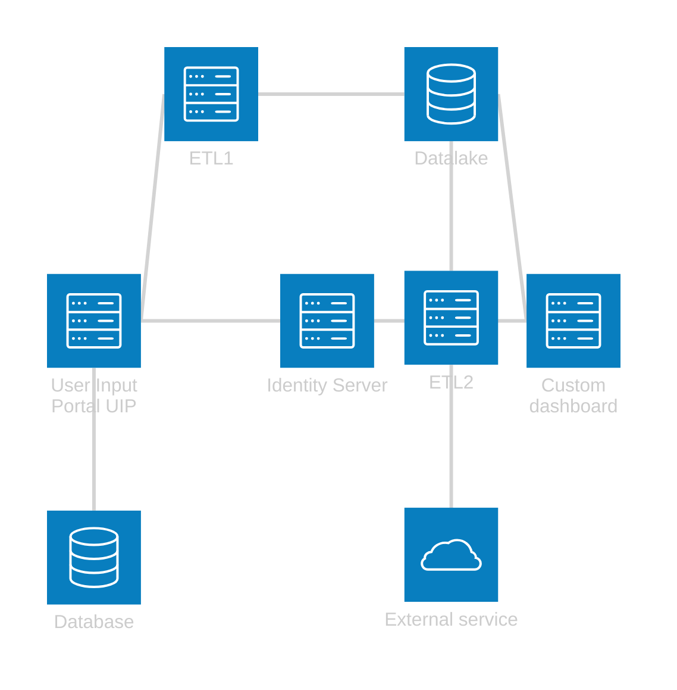
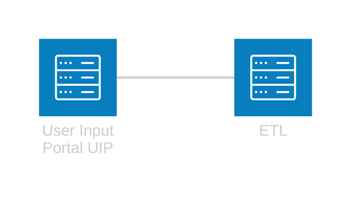
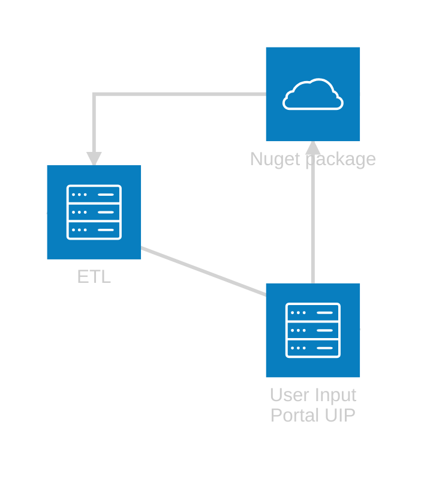
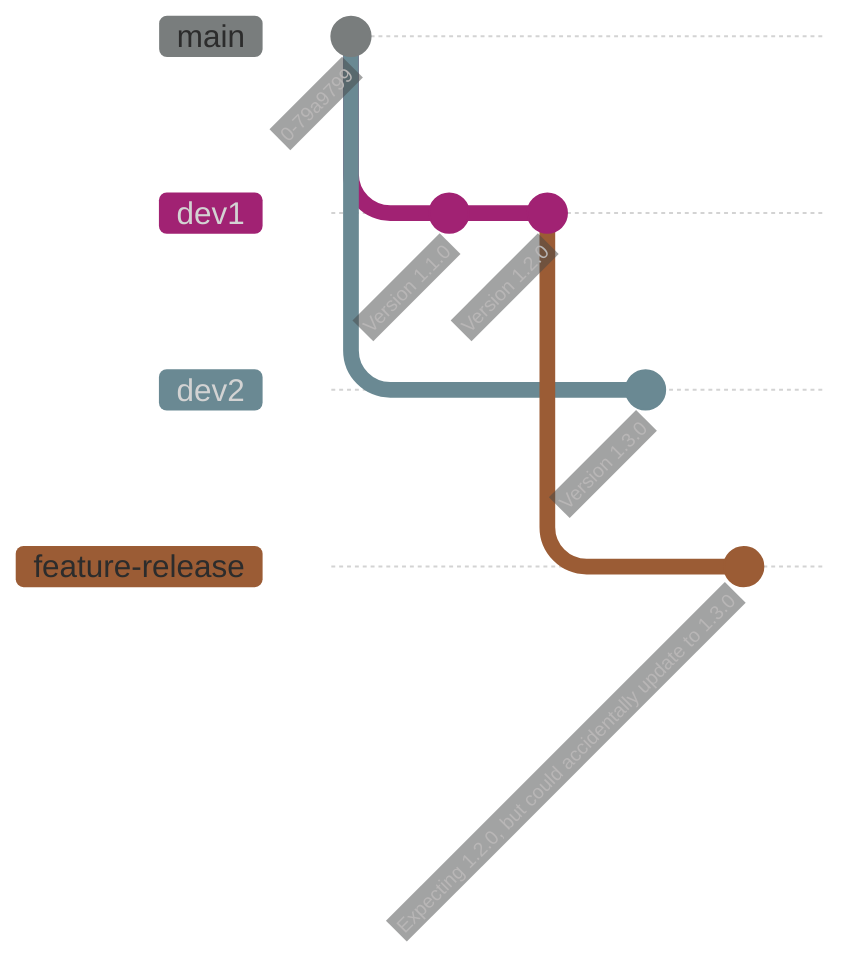
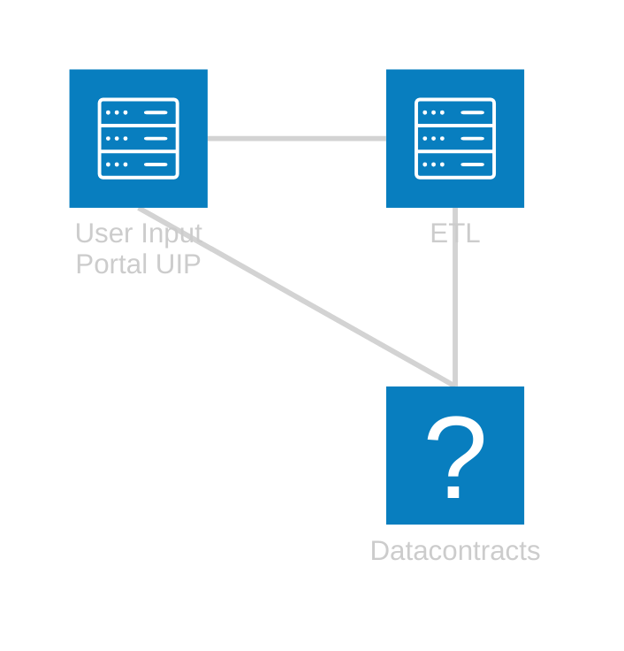
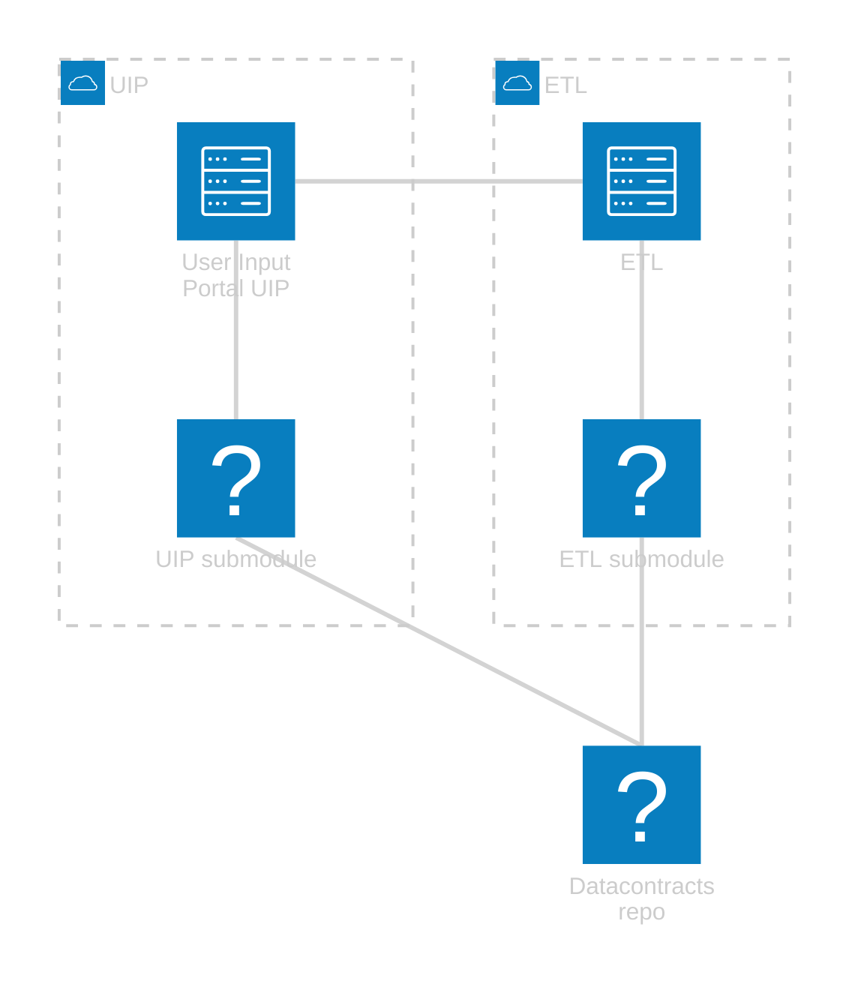
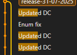
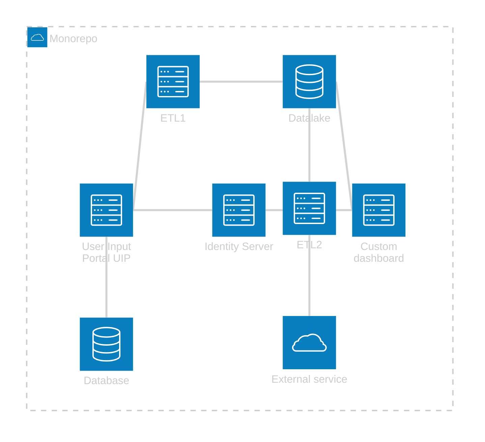

I've been working on some clients who have a bunch of sites, Azure functions, and whatnot (microservices, but not so micro) and each one is it's own git repo.  
They started off with limited data sharing and intercommunication, but over time this interdependency increases, now I'm asking why these apps are different apps in the first place.  
It has come to my attention that it has a name: distibuted monolith.  
Changes that ripple through them are difficult to do, track, and maintain, so what options do I have?  
Well I went down this road of three options, let's see how it's turned out.  

<!--more-->  

# Setup  

```mermaid
---
config:
  theme: 'dark'
---

architecture-beta
    service userinputdb(database)[Database] 
    service userinput(server)[User Input Portal UIP]
    service dashboard(server)[Custom dashboard] 
    service etl1(server)[ETL1] 
    service etl2(server)[ETL2] 
    service external1(cloud)[External service] 
    service dw(database)[Datalake] 
    service identity(server)[Identity Server] 


    userinputdb:T -- B:userinput
    userinput:R -- L:etl1
    external1:T -- B:etl2
    etl1:R -- L:dw
    etl2:T -- B:dw
    dw:R -- L:dashboard
    dashboard:L -- R:identity
    userinput:R -- L:identity
```

The loose contracts between these apps were handled manually, and changes made in the UIP database would have to be manually copied over to the other projects if required.  

> The ETL process might be strange too, I'm not sure how common it is to have an Azure function that does it's ETL by calling the API for the data using those contracts...
> It feels kinds nice, but also leads to this stronger coupling.  

Before we go on, let's just simplify that diagram above for later use.  
We'll focus on the interaction between two services and how the coupling there worked.  
Just note that these contracts were used in many of those other projects too.  

## Simplified setup for future use  

```mermaid
---
config:
  theme: 'dark'
---

architecture-beta
    service userinput(server)[User Input Portal UIP]
    service etl(server)[ETL]    
    userinput:R -- L:etl
    
```

# What's wrong with a distributed monolith?  
Distributed monoliths are a set of services that have strong coupling between them, but are deployed separately.  
In my experience, this is rarely the intent, and results from microservices getting more and more coupled as time goes on. 
You can imagine that deploying part of your app (which is essentially what distributed monoliths are doing) without the rest can lead to strange, tedious, and error prone releases.  
In this particular case, a new team member forgot to add a property to the ETL datacontract (and DbContext) and the Test ETL process crashed and burned.  
That wasn't their fault in my opinion as there was no gate preventing such a mistake, no message or anything prompting them to have done so.    
We have PR's to help catch these incidents, but it still felt like an unnecessary risk in this day and age (circa 2018)  

Refactoring becomes difficult to maintain, with no built-in way of preventing contracts getting out of date.  

## Before we start: What do I want?  
All I really want is to make the releases simpler, more easily tracable, and less error prone.  
I didn't have time to rework everything, so a full upfront rewrite/rework wasn't possible.  
What follows is the sequence of solutions we've worked through over the last 5+ years to try and improve the situation (in chronological order)  

# First attempt: Shared nuget package  
The idea is:
- Extract and distill both sides of the contracts into their own project  
- Publish this project as a nuget package during CI (on internal feed)
- Reference nuget in related projects

```mermaid
---
config:
  theme: 'dark'
---

architecture-beta
    service userinput(server)[User Input Portal UIP]
    service nuget(cloud)[Nuget package]
    service etl(server)[ETL]    
    
    userinput:T --> B:nuget
    nuget:R --> T:etl
    userinput:R -- L:etl
```

**Pros:**   
- Easy to setup   
- Flexible enough  

**Cons:**  
- Versioning becomes ridiculous, especially with multiple branches  
- Difficulties reasoning about which version is which  

## Versioning is hard  
The versioning was just 1.x.x and we could manually update the major version, and the minor would tick along as the build number.  

This can lead to the following scenario where the latest build is the latest version of the shared contracts.  
In this scenario, each commit is pushed up to the CI pipeline where it builds and creates a new nuget package.  

```mermaid
---
config:
  theme: 'dark'
  gitGraph:
    rotateCommitLabel: true
---
gitGraph
    commit
    branch dev1
    branch dev2
    checkout dev1
    commit id: "Version 1.1.0"
    commit id: "Version 1.2.0"
    checkout dev2
    commit id: "Version 1.3.0"    
    checkout dev1
    branch feature-release
    commit id: "Expecting 1.2.0, but could accidentally update to 1.3.0"
```

When I see `version 2.3.0` what does it mean? Which branch was it?  
The no-context information was lacking.  

This is almost certainly the laziest and least useful method of versioning in this scenario, but I couldn't figure out a better way a the time.  
Local dev was pretty frustrating when working with the dependent project if you needed changes in the nuget package.  
You could build the source in CI, update nuget, and continue working, but it was way easier to just temporarily reference the source dll while developing. 
Not a great experience.  

## Rebuild and redeploy (usually) required but not enforced  
Rebuilding and redeploying is technically a requirement for all of these options, but in the nuget case, there was no trigger to enforce it.   
You could forget to update it, and the build may not complain depending what changes were made, and the deployment would succeed, and it would fail at runtime.  
I really wanted to ensure that we couldn't just *forget*.  

# Second attempt: Git Submodules  
[Git submodules](https://github.blog/open-source/git/working-with-submodules/) are a way of embedding one repo into another.  
Following a similar idea to the nuget idea, I just pulled the project that used to be a nuget into it's own git repo.  
Then this repo was submoduled into the related projects.  
I figured it was a low friction way of forcing the shared code to be correct, while improving the dev experience.  
> Foreshadowing: this is not quite how it worked...

```mermaid
---
config:
  theme: 'dark'
---

architecture-beta
    service userinput(server)[User Input Portal UIP]
    service etl(server)[ETL]    
    service dc(s)[Datacontracts]

    userinput:R -- L:etl
    dc:T -- B:userinput
    dc:T -- B:etl
```

The dev flow was you'd make branches in the app repo and DataContracts submodule if required, then that branch could be shared across the multiple projects that needed it.  

**Pros:**  
- Easy to reason about (in isolation!)  
- Decent dev experience  

**Cons:**  
- Hard to reason (in general), lots of branches means things get confusing  
- Lots of git tools handle submodules, but often not trivially or completely (hard to know what exactly is checked out, auto fetches root repo, but not submoules, etc)  
- Commits can often be "update submodule" and nothign else, makes rebasing hard  

That above diagram looks simple, but in reality, it wasn't a shared project across different apps, it was a copy of that repo across those projects.  
You end up with `projectCount` copies of the DataContracts repo on your machine, each potentially with different branches going at once...  

## More realistic diagram  

```mermaid
---
config:
  theme: 'dark'
---

architecture-beta
    group uip(cloud)[UIP]
    group etlgroup(cloud)[ETL]

    service userinput(server)[User Input Portal UIP] in uip
    service etl(server)[ETL] in etlgroup
    service dc(s)[Datacontracts repo] 
    service uipdc(s)[UIP submodule] in uip
    service etldc(s)[ETL submodule] in etlgroup

    userinput:R -- L:etl
    uipdc:T -- B:userinput
    etldc:T -- B:etl
    uipdc:B -- T:dc
    etldc:B -- T:dc
```

In reality, 

This means that in practice you have `projectCount` copies of the DataContracts repo on your machine, each potentially with different branches going at once...  

## Reasoning with branches! 🤢  
As foreshadowed above, the shared code isn't as forced as I thought it'd be.  
The submodules need to be `git pull`ed in each project, and devs can still forget to do that.  
This could be fixed with submodule auto-fetch, but I didn't try that as I thought the other negatives outweighted this.  

I felt it can get confusing with branches when you have three different DataContracts repos open for different apps, and you're trying to understand what code is on which branch in order to support the various apps. 

> I'm a force pusher, so I think I made this harder for myself than it needed to be.  

## Commit message: 'Updated submodule'  
When pulling in changes from other branches, we'd have lots of commits that were solely: "Update submodule", or "Pull in changes from contracts"  
This was noisy to look at and worse, it made rebasing super messy.  
There was almost always conflicts with the submodules (I assume simply because the commit hash is different?)  
As such, rebasing went: 
- Ignore any submodule changes, just pick one or the other
- Update submodule commit at the end with 'Updated Datacontracts'

However, the commits don't work in isolation and you have to stop at each commit to fix it.
Every. Single. Commit.  

# Subtrees?  
[Git subtrees](https://www.atlassian.com/git/tutorials/git-subtree) are something I saw as similar to submodules, and they seem to improve on submodules by handling changes more transparently than a commit pointer.  
I didn't investigate as I heard about them too late, and upon reflection decided that they would have similar updating issues to submodules.  

# Distributed Monolith --> Monorepo Monolith  

```mermaid
---
config:
  theme: 'dark'
---

architecture-beta
    group all(cloud)[Monorepo]
    service userinputdb(database)[Database] in all
    service userinput(server)[User Input Portal UIP]in all
    service dashboard(server)[Custom dashboard] in all
    service etl1(server)[ETL1] in all
    service etl2(server)[ETL2] in all
    service external1(cloud)[External service] in all
    service dw(database)[Datalake] in all
    service identity(server)[Identity Server] in all


    userinputdb:T -- B:userinput
    userinput:R -- L:etl1
    external1:T -- B:etl2
    etl1:R -- L:dw
    etl2:T -- B:dw
    dw:R -- L:dashboard
    dashboard:L -- R:identity
    userinput:R -- L:identity
```

Here I moved every service from their own repos into one big repo.  
But...[monorepo bad](https://medium.com/streamdal/mostly-terrible-the-monorepo-5db704f76bdb)?  
The general hate is that monorepos are big and hard to use, but I disagree and decided that a distributed monolith was worse than a monorepo monolith.  

**Pros:**  
- Simple, only one sln to build (and can use solution filters to narrow it further)
- Can't be out of date between projects  
- Single atomic deployment  

**Cons:**  
- Big and slow to build and test everything  
- Lots of entrypoints   
- "Need" to deploy all projects to make simple change in one project  

## How did I integrate them all?  
I broadly followed [this](https://gfscott.com/blog/merge-git-repos-and-keep-commit-history/) approach from Graham Scott.  
- In each repo, move everything into a subfolder named like itself (repo was called UIP, so move it all into `repo/UIP`)  
  - This way there's no merge conflicts when we smoosh everything together.  
  - Put these changes on their own branch e.g. `tech/monorepobranch`
- Create new git repo for everything to live  
- Add each repo to the list of monorepo remotes
  - `git remote add -f remotename ../remotesource`  
  - `../remotesource` is the path to the individual git repos, can be https:// paths.  
- Merge each repo into the big boi  
  - `git merge remotename/monorepobranch --allow-unrelated-histories`  
  - `--allow-unrelated-histories` keeps the history of the individual repos  
- Remove remotes  

## Simple changes in one service requires full rebuild/redeploy?  
This is the main downside for this approach.  
Building and deploying all apps for a tiny text change in one of five sites is excessive, but it does avoids the common issue where one site has way more deployments than the others, and all the version numbers are different, making deployments harder to trace.  
In sustained engineering, the time saved by having all five services on the same version by default as opposed to going through multiple repos, builds, and deployments is very much worth it.  

One branch, one build, one deploy, one day later...(cos the build takes ages)  

## Rebuild entire build and release pipeline...  
This was another major sticking point as each service is already slow to build and test.  
Combining all services in one meant rebuilding the pipeline, which was fun and good for cleaning the cruft out (looots of it too), but it does add risk and may not be something the client wants to pay for.  

Silver lining is that I now have some experience in yaml pipelines!  

# What code artifact is deployed where?  
I'm not sure where else to put this, but it's a big part of my life in Managed Services/Sustained Engineering.  

Let's say UIP service was being developed more often than the ETL job, and it had 5x more deployments.  
Let's also say that the DataContracts were being changed for UIP and Admin, but not in a way that broke the ETL.  
For example: Adding properties to the contracts for Admin, but weren't 100% required in the ETL job.  

Now the client asks "Ok so now we want the ETL job to use those, will that work?".  
I find figuring out where the ETL code is up to compared to the others regarding the shared contracts to be pretty difficult and/or time consuming.  
Flicking back and forth between different repos and environments and trying to determine what changes are going to affect the ETL job and database takes a lot.  

In that example, it could be argued that we should have separate contracts for different apps.  
Fair, but it wasn't present when I got it, and I didn't want to add them; I believed they were conceptually the same, and should be represented by one entity.  

So, is this new monorepo world in a better state than before?  

# Conclusion: Which is best?  
As always, it depends.  
I think that:  
- Nuget was the worst option  
- Submodules are not great  
- Monorepo feels nice, if busy  

Lots of entrypoints will take time to get used to, but deleting whole swaths of code to centralise and standardise across the projects is pretty satisfying.  
Hopefully it pays off.  

Also...it's going to be pretty hard to undo the monorepo, so we'll probably stick with it. 