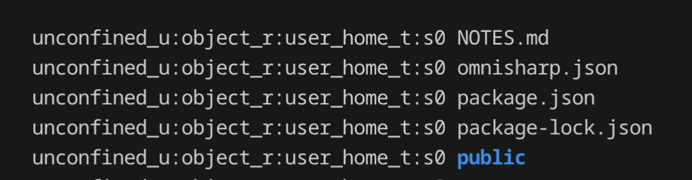
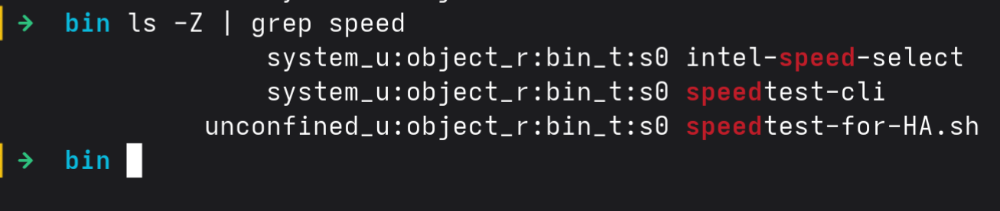
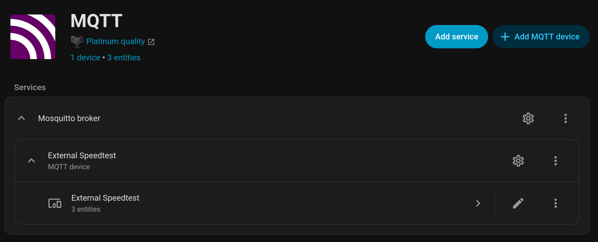
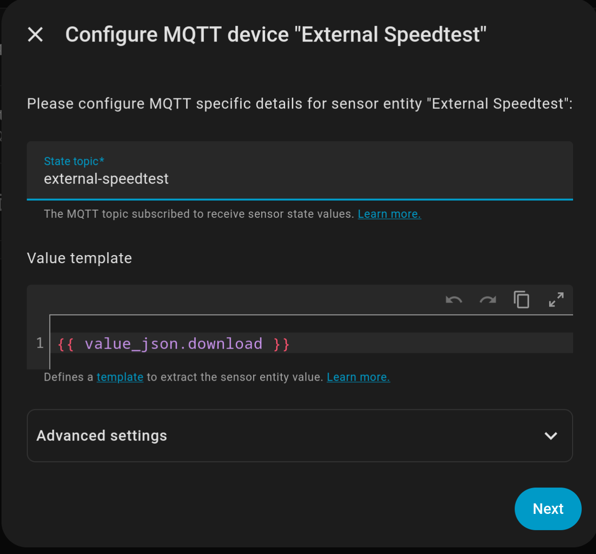
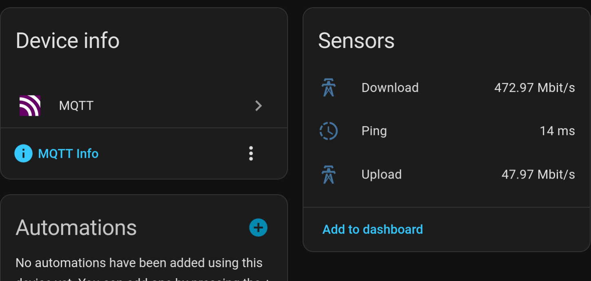

I've finally had time to fiddle with my Home Assistant setup, specifically I wanted to monitor my ISP download, upload, and ping.  
I wanted this because my internet was playing up and I wanted to track it, and also moar charts on my dashboard makes me happy.  
The TL;DR is: HA host was too slow, so I ran the test on another machine and reported the results back to HA via MQTT.  

<!--more-->  

There is an [existing Speedtest plugin](https://www.home-assistant.io/integrations/speedtestdotnet/) for Home Assistant which I started using, but it was showing really low speeds and I realised it's because I was running them on my Pi3 over wifi.  

The Pi was busy running HA and wifi wasn't doing me any favours either, so I figured "surely I can run it elsewhere and have HA get the results".  

# Basic setup  
- HAOS on a Pi3 running latest rasberrian x64 as of 2026  
- Speedtest-cli on external machine (Fedora 43) 
- `systemd` timer and service + Mosquitto to send results  

# External machine setup  

## Scripts and systemd services  

> Almost all of this was built with ChatGPT assistance.  
> I have limited experience with systemd and linux permissions.  

{}
{}
```bash
# speedtest.timer
[Unit]
Description=Run speedtest-mqtt periodically

[Timer]
OnBootSec=5min
OnUnitActiveSec=1h
AccuracySec=1min
Persistent=true
User=myuser
Group=myuser

[Install]
WantedBy=timers.target


# speedtest.service
[Unit]
Description=Run speedtest and publish results to MQTT
Wants=network-online.target
After=network-online.target

[Service]
Type=oneshot
ExecStart=/usr/bin/speedtest-for-HA.sh

# Safety & robustness
TimeoutStartSec=2min
Nice=10

[Install]
WantedBy=multi-user.target

```
{}
{}
```bash
#!/bin/bash

speedtest-cli --json \
| jq -c '{download: (.download/1000000), upload: (.upload/1000000), ping: .ping}' \
| mosquitto_pub -h homeassistant.local -i external_speedtest -l -t external-speedtest -u mqtt -P homeassistant

# speedtest-cli exported as json
# jq: json formatting of results
# -c: minify json. REQUIRED otherwise HA receives a message per line and doesn't work.
# {download...}: Extract and reformat json results to project them in a way HA accepts.
# -h: HA Hostname
# -i: ID of this client (not sure if it's required?)
# -l: read from stdin DIFFERENT MESSAGE PER LINE. Important as if missing -c, each prop is on a different line and is sent as a different message which is invalid json.
#     - Sounds like I could remove -c and use -s instead?
# -t: MQTT topic to send to
# -u: MQTT user to send as
# -P: MQTT password
```
{}
{} 

## Linux permissions issues  
I had issues with SELinux (on Fedora) where the systemd service "couldn't find" the script with "unable to find executable: permission denied".  
Since the script already had execute permissions (`chmod +x`) and the path and general permissions seeming ok, Chatgippity suggested seeing if SELinux was disallowing it.  

I know so little about SELinux, I basically just did what it told me to do.  
This `sudo ausearch -m avc -ts recent` seems to show recent SELinux activity, and showed that the systemd service didn't have execute permissions. 
I had to do this to give it those permissions.
```bash
sudo semanage fcontext -a -t bin_t "/usr/local/bin/my-script.sh"
sudo restorecon -v /usr/local/bin/my-script.sh
```

> Further note that I had to move my script out of `/home/MYUSER` and into `/usr/local/bin`, or `/usr/bin` otherwise those above settings wouldn't stick.

`ls -Z` shows security info about the listed files and has a crazy string next to it.




# Home Assistant setup  
From memory, I went "Add MQTT device" and added the "external speedtest" sensor.  
Then I added the other two sensors. 

  


