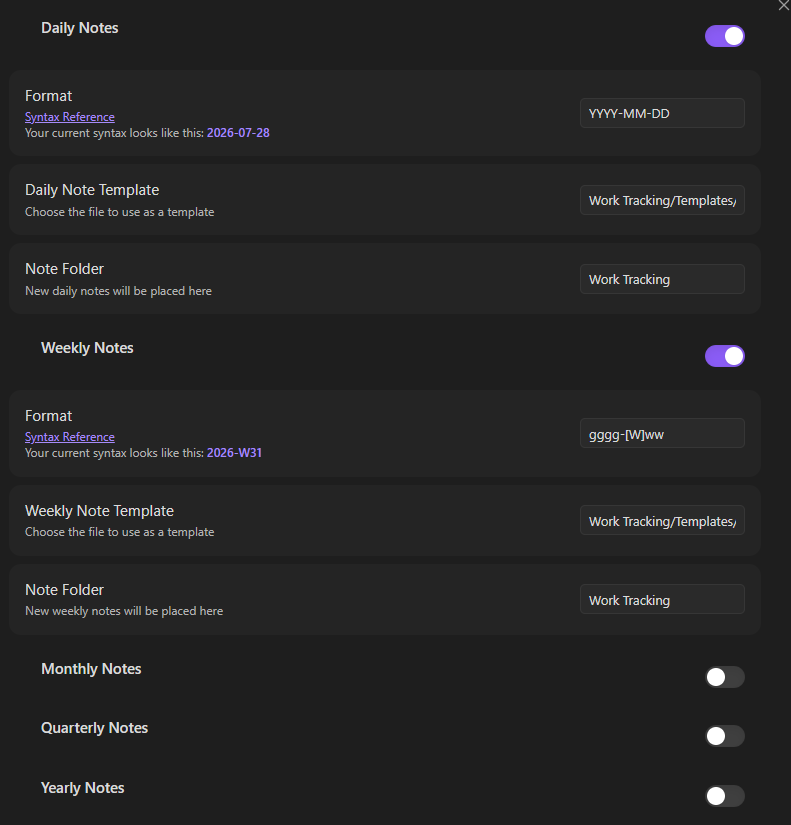
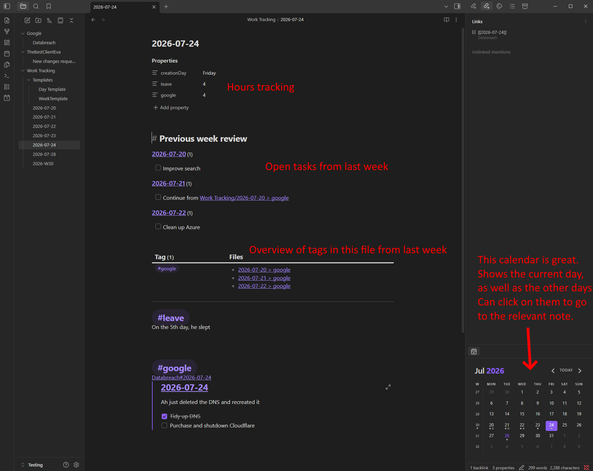
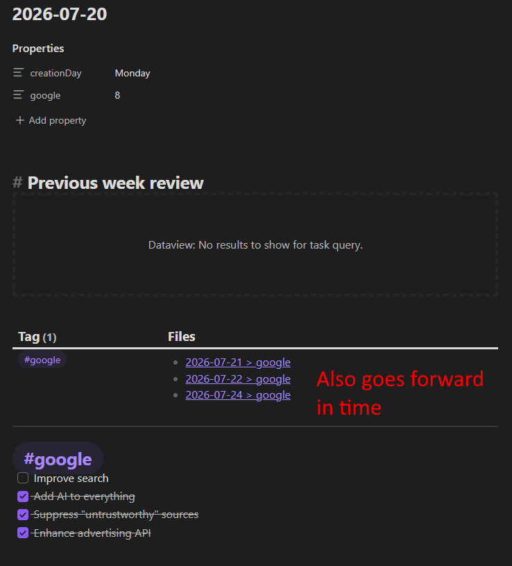
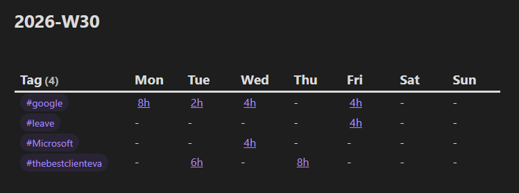
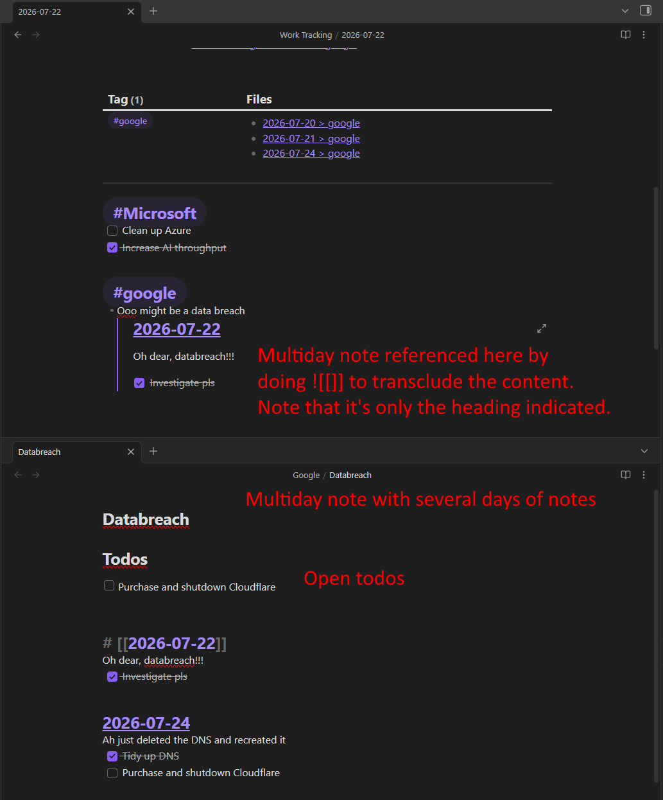

I watched a few videos on how to do good notetaking with Obsidian, but they all involved processes, and strategies, and revisiting and bit german words, and I knew that wasn't for me.  
I wanted the easiest possible entry, which was just to start writing.  
Over time, I added and augmented more and more until I developed my own style, and I suggest you do so as well.

This post is about what works for me, but it could spark ideas for you or prompt you to setup something similar.
I'm not going to work through from the beginning, but explain what I have now and why.

<!--more-->  

{}

# What is Obsidian  

For those unaware, [Obsidian](https://obsidian.md/) is a note taking app that stores data as markdown files.  
It's similar to [Notion](https://www.notion.com/) but not as fancy looking (maybe you could say Notion is the Apple and Obsidian is the Android) 

I came from Onenote which I enjoyed for it's flexibility and ease of use, but when I had to move my notes from one account to another and it was difficult and annoying, I looked for an alternative.  

## Pros
- Your notes are yours, markdown forever  
- Simple to use, lots of help  
- Fast
- Code fences and syntax highlighting

## Cons
- Closed source (if you care)  
- It's a glorified text editor, so can't just draw all over it, or start typing in any random place on the page  
    - Yes, I'm aware of the [Excalidraw plugin](https://forum.obsidian.md/t/excalidraw-full-featured-sketching-plugin-in-obsidian/17367) but it was fiddly for me

# Obsidian Setup  
There are lots of core and community plugins to play with, and I'd say the critical ones are:   

## Core  
- [Properties View](https://obsidian.md/help/plugins/properties)
- [Daily Notes](https://obsidian.md/help/plugins/daily-notes) (not actually sure how much this is used, I don't have the `template file location` set, just the `new file location`)

## Community  
- [Advanced tables](https://community.obsidian.md/plugins/table-editor-obsidian) (makes working with markdown tables way easier)
- [Calendar](https://community.obsidian.md/plugins/calendar) (to get that nice calendar view to click on)
- [Dataview](https://community.obsidian.md/plugins/dataview)
- [Natural Language Dates](https://community.obsidian.md/plugins/nldates-obsidian)
    - Date format: `[Work Tracking]/gggg-MM-DD`. 
        - `gggg` is the week year, that is, when a week spans a year, the days falling in the next year, it'll still be in the year from the start of the week...maybe I need to fix that. I don't remember why I did it this way.  
- [Periodic notes](https://community.obsidian.md/plugins/periodic-notes) (for templating the daily notes)



> Note I'm using two templates, one for daily and one for weekly. I'll come back to that.  

# Usage

I start every day by clicking on the date in a calendar (or the "today" tile in the left sidebar) and it creates the note for that day.
These notes can be customised with templates, and I like to have a [previous week review](/content/posts/2023-01-20-obsidian-previous-week-review/index.md) which shows the open tasks from the last few weeks (naming is hard alright...)

## Daily note    
I want to get as many useful bits of info in the one place when I start my day.  
With this setup, I get my hours, open tasks, overview of client work, etc before I even start today's note.  
But it's also non-blocking, I can just click on the "Today" link and get started, filling things in later.  
In Notion, I had to think about databases and whatnot, and I don't here (but you can if you want with [Bases](https://obsidian.md/help/bases))

{}
{}

{}
{}

{}
{}  

The template is a crazy bit of madness that I scrapped together, and I swear the JS is terrible, but I had a hard time with the documentation and manual digging into the API. 

### Daily note template
````c
---
creationDay: "{{date:dddd}}"
---
# Previous week review
```dataviewjs
// Dev console: Ctrl + shift + i

let currentFile = dv.current().file
let currentYear = currentFile.day.year
let currentWeekNumber = currentFile.day.weekNumber

let matchingFiles = dv.pages().filter(x => {
  const d = x.file.day
  if (!d || x.file.name === currentFile.name) return false

  // This week or last week
  // Note this doesn't work over the new year, but that's ok
  const isInThisYear = currentYear === d.year
  const isInThisWeek = currentWeekNumber === d.weekNumber
  const isInLastWeek = d.weekNumber === (currentWeekNumber - 2)
  const notInTheFuture = currentFile.day.ts >= d.ts
  const withinDateRange = notInTheFuture && isInThisYear && (currentWeekNumber - d.weekNumber) <= 2
  return withinDateRange
})

const tasks = matchingFiles.flatMap(f => f.file.tasks.where(t => !t.completed))

dv.taskList(tasks)
```

```dataviewjs
const currentFile = dv.current().file
let luxonDate = currentFile.day
let currentYear = luxonDate.year
let currentWeekNumber = luxonDate.weekNumber
let fileTags = currentFile.tags

let matchingFiles = dv.pages().filter(x => {
  const d = x.file.day
  if (!d || x.file.name === currentFile.name) return false

  // This week or last week
  // This doesn't work over the new year, but that's ok
  const isInThisYear = currentYear === d.year
  const isInThisWeek = currentWeekNumber === d.weekNumber
  const isInLastWeek = d.weekNumber === (currentWeekNumber - 1)
  const withinDateRange = isInThisYear && (isInThisWeek || isInLastWeek)
  
  const hasMatchingTags = x.file.tags.some(t => fileTags.includes(t))
  return withinDateRange && hasMatchingTags
})

const flattened = matchingFiles.flatMap(x => x.file.tags.filter(t => fileTags.includes(t)).map(t => ({tag: t, link: {...x.file.link, subpath: t}})))
const grouped = flattened.groupBy(x => x.tag)
const indexed = grouped.map(x => {
	const sorted = x.rows.sort(t => t.link.path)
	const cleanLinks = sorted.map(t => ({ subpath: t.link.subpath, path: t.link.path.replace('Work Tracking/', '').replace('.md', '') }))
	const strings = cleanLinks.map(t => `[[${t.path}${t.subpath}]]`)
	return [x.key, strings]
})

dv.table(['Tag', 'Files'], indexed)
```
---
````

Tags + header links are useful for tracking which client I'm working on.  
It's collapsible, extractable (in Weekly note), and linkable.  
The tag is then further useful as a file property for the weekly note. 

> Ideally, I'd figure out how to automatically add a property when creating a heading + tag, but I haven't done that yet.  

You can see this hours tracking in the above screenshot, and they get pulled through into the Weekly note.  

## Weekly note (for timesheeting)  
I use the weekly note + client tags + properties hours tracking to essentially create a timesheet in one click.  
It's a decent summary of what was happening for that week, and it auto updates when you need to go back and tweak things (like forgetting to fill in hours and such)



### Weekly note template
````c

```dataviewjs
const currentFile = dv.current().file
let luxonDate = DateTime.fromFormat(currentFile.name, "kkkk-'W'W")
let currentYear = luxonDate.year
let currentWeekNumber = luxonDate.weekNumber

let matchingFile = dv.pages().filter(x => {
  const d = x.file.day
  if (!d || x.file.name === currentFile.name) return false

  // This week or last week
  // This doesn't work over the new year, but that's ok
  const isInThisYear = currentYear === d.year
  const isInThisWeek = currentWeekNumber === d.weekNumber
  const isInLastWeek = d.weekNumber === (currentWeekNumber - 1)
  const withinDateRange = isInThisYear && (isInThisWeek)
  
  return withinDateRange
})

let indexed = matchingFile.flatMap(x => x.file.tags
	.map(t => ({ 
		tag: t, 
		link: {...x.file.link, subpath: t}, 
		weekday: x.file.day.weekdayShort, 
		toplevel: x 
	})))
.groupBy(x => ({tag: x.tag}))
.map(x => {
	let dayMap = {
	Mon: undefined,
	Tue: undefined,
	Wed: undefined,
	Thu: undefined,
	Fri: undefined,
	Sat: undefined,
	Sun: undefined
	}
	
	const sorted = x.rows.sort(t => t.link.path)
	const cleanLinks = sorted.map(t => ({ 
		toplevel: t.toplevel,
		weekday: t.weekday,
		subpath: t.link.subpath, 
		path: t.link.path.replace('Work Tracking/', '').replace('.md', ''),
		hours: t.toplevel[x.key.tag.replace('#','')] ?? 0
	}))
console.log(cleanLinks)
	
	cleanLinks.forEach(t => {
		const val = `[[${t.path}${t.subpath}|${t.hours}h]]`
		dayMap[t.weekday] = (dayMap[t.weekday] ?? '') + ' ' + val
	})
	
	const values = Object.values(dayMap)
	return [x.key.tag, ...values]
})

dv.table(['Tag', 'Mon', 'Tue', 'Wed', 'Thu', 'Fri', 'Sat', 'Sun'], indexed)
```
````

# Long running/multiday notes  
This is the other critical use case for me: a longer-than-one-day topic that I can track daily.  
These can be issues like P1 tickets, or long running investigations into something like database performance or reworking a feature implementation.  
Initially, I just wrote down the details on the daily note per day, but then I wanted to read over the whole thing, which was now difficult, despite those notes being linked together.  

The solution I have is to create a single note to contain all the knowledge, but with headings linked to the relevant daily note.  
I can read down the flow of the investiation, while also correlating what happened on what day.  
It's also useful to use `![[]]` wikilinks which transcludes the content, showing it in the daily note without having to copy paste it.  

## Task tracking  
These big notes can get unweildy to determine what is left to do.  
I could have tasks on the relevant daily note, but it makes more sense to have the tasks here.  
However, then it becomes difficult to track what is done and what isn't, especially if you're pasting long sql queries or images that mean lots of scrolling.  

As such, it's handy to have a little dataview block at the top to collect all the open tasks in the note as a "todo list".  

````md
```dataview
TASK
where file.path = this.file.path and !completed
```
````

