Semi-recently, we moved a client from On Premises to Azure with the promise that it'd be better.  
While generally true, lately we've been getting reports of performance issues...  

<!--more-->  

# The Setup  
We knew we'd have to tweak the App Service and Database tiers to get the desired performance.    
We had App Insights hooked up to inform us of slow queries, many of which we and the client were already aware of because they were slow in their On Premises environment.  
Those were good times, client happily trucking along with their app, us happily adding new features, fixing bugs, etc.  

But that all changed when the Fire Natio- I mean, the reports began to emerge...  

# The Observations  
After a while and many releases, we started to get reports of slowdowns and occasionally "gridlocks", where everyone would be looking at a spinner.  
We jumped on App Insights to see what was going on, expecting to see CPU or RAM or something capping out on the App Service or Database.  
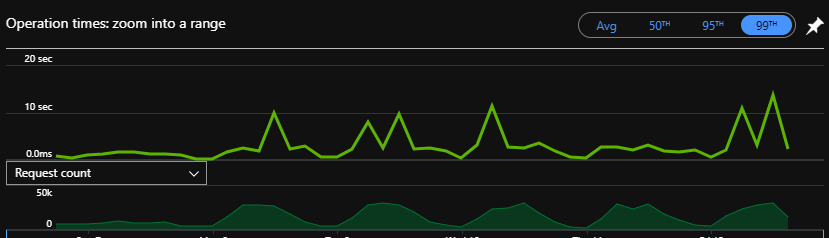  

Unfortunately, while we could see spikes, they didn't look to be affecting all other requests,  and further, when looking at the timeline, there were huge gaps between SQL calls.  
This indicated that it wasn't SQL queries slowing things down, and the other occurrences of these requests didn't have this slowdown.   
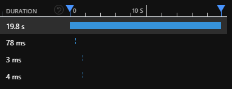  

What was going on here?  

# The Actions  
## Advanced Diagnostics and Troubleshooting  
I roped in a colleague to take a look, and they pointed me to the App Service Diagnostics page.  
Pretty nice little collection of diagnostic information, if somewhat unnecessary with App Insights.  
They wanted to see the SNAT and TCP connections area, wondering if we were making a mess with the HttpClient which you [shouldn't dispose](https://www.aspnetmonsters.com/2016/08/2016-08-27-httpclientwrong/).  
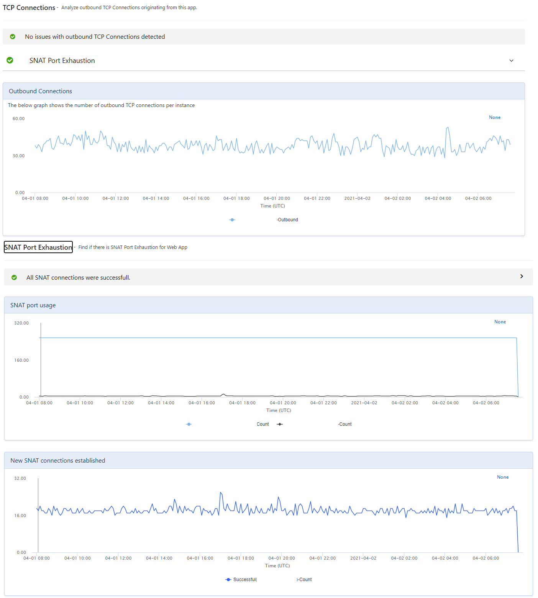  

We weren't and the connections were healthy, and after looking at the other metrics, they too were at a loss.  

## Ramping up! Aaaand back down  
At this point, we decided we'd just scale up and continue investigating while the client was happy, so we went to Premium Tier!!!  
Unfortunately...for reasons unknown, our Premium app service couldn't talk to the storage account that the WebJobs use for lock files. 
After struggling with that for a while, we just had to scale back down.  
Later in the piece, we did manage to scale it up to Premium with no trouble, but we're none the wiser.  

# The Digging  
Now we really had to know what was going on.  
I spent many days looking into Azure Profiler traces of the slow requests.  
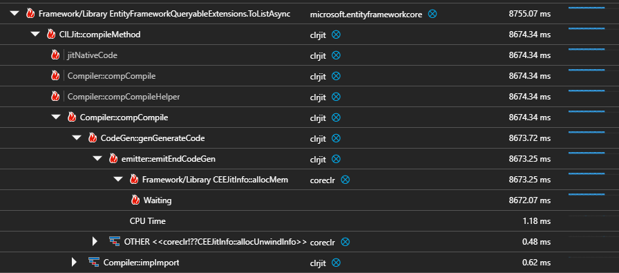  

Most of them pointed at EFCore's ToArrayAsync method, which indicated to me that it was the database being slow, but I couldn't see any evidence of that in the database metrics.  
I considered that it might be the serialisation/deserialisation of the EF models, but I couldn't find a way to measure that aside from rowcounts, which all seemed fine.  

## The Garbage Dump  
Another colleague saw what I could not, this tiny little button that you'd never know was there if it wasn't pointed out to you:  
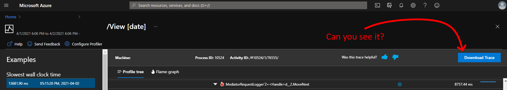

After downloading some of the traces and opening them in PerfView, I saw this:  
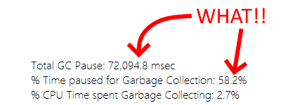  

58% of time in GC?! 72s GC pause!?!?!?!  
This could be a red herring, but we see it in a bunch of other traces as well, including current traces.  

## Threading the garbage  
Now I was considering that maybe we have a threading issue.  
This and other traces often point at `ntoskrnl::SwapContext` as the Waiting method, which is context switching between threads.  
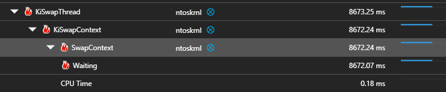  

I read around and asked people, and apparently the C# ThreadPool lets the app make threads as fast as it wants until hitting the MinThreadCount (usually processor count), before enacting an "algorithm".  
Apparently this mighty algorithm tends to have a [500ms throttle](https://stackoverflow.com/a/46836192) on creating threads, which would mean that in situations where we wanted a load of threads fast, OR when we were near our limit and wanted another one quickly, we might be forced to wait half a second.  
I don't know how to confirm whether that's what's happening to us or not, except to just yeet that limit: `ThreadPool.SetMinThreads(150, 150);`  

We're looking to up that limit to 150 threads before the algorithm kicks in, which might help? I dunno, especially as there is [some evidence](https://ayende.com/blog/179203/production-postmortem-30-boost-with-a-single-line-change) that it makes things worse.    

## Justifiably Irritating Timeouts  
While I was in PerfView, I had a bit of a look around at all the interesting info that's in there.  
Look at all this stuff, how cool is- did that just say JIT was taking 3016 seconds for EF lambdas?  
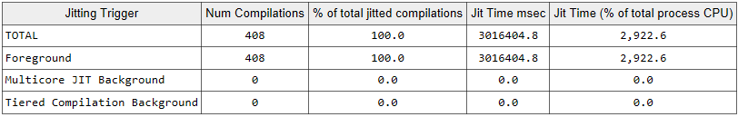  

I think that's what that means, and I'm almost certain this is a bit misleading RE performance.    
Still, I googled for ages but am no closer to knowing if that's what that means, or how to address it if it is.  

# The Hands in the Air  
Now we were scraping the barrel.  
We noticed that the AppService was running as x86 and the Webjob was running x64.  
"Ooo," we thought, "perhaps it's seeing memory pressure when certain actions are taken, forcing a huge GC?"  
We moved to x64 and things do seem to have improved ¯\\_(ツ)_/¯  
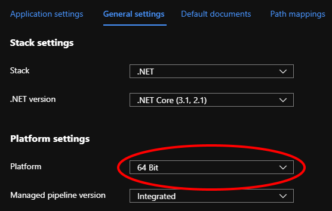  

## When in doubt, Log  
The last thing I'm writing about is the first thing we did, which is to add a load of logging to requests and Mediator actions.  
We wanted to try and get an idea of where exactly things were slow, whether those things were always slow, or slow during certain hours of the day, any kind of pattern.  
As of yet, one has yet to emerge, however we can now use the AppInsights -> Logs and it's Kustu query language, which is nice.   

``` SmallTalk
traces
| where message startswith "Finished Mediator"
| where timestamp between (datetime(2021-03-01)..datetime(2021-04-01))
| project customDimensions
| extend Duration = toint(customDimensions.ElapsedMs), RequestName = tostring(customDimensions.Request), Application = tostring(customDimensions.Application), Environment = tostring(customDimensions.DeploymentEnvironment)
| project-away customDimensions
| where Application == "<OUR APP>" and Environment  == "production"
| summarize avg(Duration), cc = count() by RequestName
| order by avg_Duration
| top 10 by avg_Duration
| render columnchart
```  

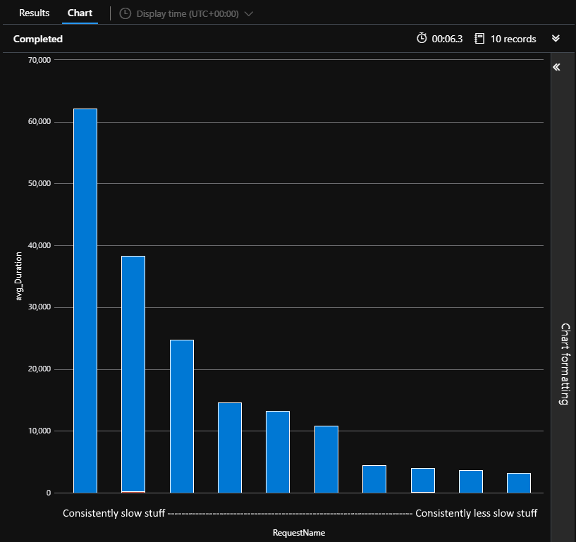  


# The Culprit  
["The cause was-oohh, eee, ahhhh!!"](https://www.youtube.com/watch?v=rR_5h8CzRcI)  

> Turns out the version I have wasn't original, and that makes no sense.    

We still don't know :(  
Things have improved since moving to x64 and a Premium App Service tier.  
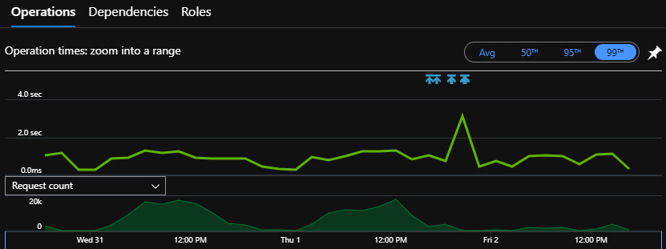