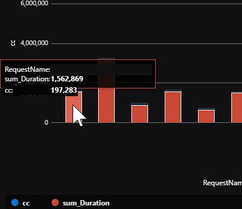
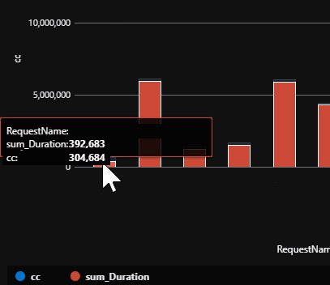

[Previously](/content/posts/26-azure-perf-investigation/index.md), I did some performance investigations in Azure. The cause remains elusive, so I've started looking into caching, most interestingly caching Mediatr Query results.  

<!--more-->  

At `client`, we make extensive use of [Mediatr](https://github.com/jbogard/MediatR) queries/commands for read/write separation. We have dropdowns populated by query, queries that call queries, etc.  
While these lookup fetches make our code a bit easier to understand due to all the reuse, it does make things less performant.  

The queries could be rewritten to be more specific, joining on and fetching the specific info that query needs, but right now, readability and maintainability are preferred over raw performance.  
However, this is starting to get us and `client` down, so I've been exploring our options.  

# Caching  
I started off by asking **"Where do we cache?"**.   
Where in the pipeline caching is done significantly changes the behaviour, complexity, and usefulness of the solution. Do we want quick and dirty, or best performance at the cost of complexity?    
After many discussions with my colleagues, I came up with a list:  

- [Redis](https://redis.io/topics/introduction)  
  - Likely the eventual solution. It would act as an intermediate database for the most frequent database accesses.  
  - Too complex right now.  
- UI
  - We use [Mobex State Tree](https://github.com/mobxjs/mobx-state-tree) for our client side state management.  
  - Caching there would prevent the server from even having to trouble itself with a response.
  - Only caches for a single browser.  
  - We'd struggle with invalidation (the age old issue).
- Controller  
  - Caching responses at the controller level (via [ResponseCache](https://docs.microsoft.com/en-us/aspnet/core/performance/caching/response?view=aspnetcore-5.0), or manual ETAG solution) came up a bit.  
  - We already use them in some cases.
  - BUT invalidation would be more difficult, and the [docs](https://docs.microsoft.com/en-us/aspnet/core/performance/caching/response?view=aspnetcore-5.0#responsecache-attribute) recommend against it's use for authenticated requests.
- [Mediatr](https://github.com/jbogard/MediatR)  
  - One of us found [this](https://github.com/Imprise/Imprise.MediatR.Extensions.Caching) caching library, prompting this as a discussion.  
  - Many client side requests are simple fetches of data that doesn't change (lookups, definitions, etc)  
  - Also used within other Mediatr requests.  
  - Caching these SHOULD reduce client side request server pressure (as `ResponseCache` would), BUT it'd also improve many other operations that use the query.  
  - Invalidation?  
- Adhoc Manual Caching with [MemoryCache/DistributedCache](https://docs.microsoft.com/en-us/aspnet/core/performance/caching/memory?view=aspnetcore-5.0)  
  - A straight up manual method would be to find things you want to cache (e.g. those lookups I mentioned earlier) and whack them into a cache.  
  - Invalidation would be the same level of complexity as adding it to the cache.  
  - Much more complex, hard to add to hundreds of queries, maintainability/comprehension, etc.  

Considering all that, I settled on a nice middleground with caching Mediatr requests. We get to reduce the lookup costs, as well as the same cost reductions in a bunch of other, heavier, unrelated queries throughout the application.  
Seeing as the caching libraries use the [Mediatr Pipeline Behaviours](https://github.com/jbogard/MediatR/wiki/Behaviors) feature, it should be "fairly simple" to implement for any query we want to cache.  

# Mediatr Caching  
I had spare time and an interest in performance, so I got to dig into it!  
Things weren't quite that simple, as the caching libraries mentioned earlier ([This one](https://github.com/SorenZ/Alamut.MediatR.Caching) by SorenZ and [this one](https://github.com/Imprise/Imprise.MediatR.Extensions.Caching) by Imprise) were pretty close, but didn't give me good invalidation or the level of control I wanted.  
Note that [my solution](MediatorCaching_Example.7z) is influenced heavily by SorenZ's solution.  

## Registering a Query for Caching  
I wanted an easy way to register the cache. Something that sat alongside our `Query` and `QueryHandler` in their folders.  
It had to be something I could just add there and be done, auto registered, no other configuration necessary for the majority of our queries.  
Here's how it looks:  

``` csharp
public class GetSomethingQueryMediatorCache : MediatorCacheConfiguration<GetSomethingQuery, string[]>
{
    protected override MediatorCacheOptions<GetSomethingQuery> ConfigureCaching()
    {
        return new MediatorCacheOptions<GetSomethingQuery>
        {
            SlidingDuration = TimeSpan.FromHours(1),
            AbsoluteDuration = TimeSpan.FromHours(10),  // Slide for 1h, but only to a max of 10h.
        };
    }
}
```

  

## Cache Configuration/Invalidation  
Cache Invalidation is always fun right?  
I also wanted this to be easy, and right next to the registration so you knew how this cache behaved in one file, without having to look elsewhere.  
That said, there is going to be more than the "happy path" requirement, so I've got several methods of controlling entry lifetime.  

- Sliding expiration  
- Absolute expiration  
- DI registered hooks (command/write triggers)  
- Manual invalidation via DI injection  

A full example of a cache configuration, including standard invalidation:  

``` csharp  
public class GetSomethingQueryMediatorCache : MediatorCacheConfiguration<GetSomethingQuery, string[]>
{
    protected override MediatorCacheOptions<GetSomethingQuery> ConfigureCaching()
    {
        return new MediatorCacheOptions<GetSomethingQuery>
        {
            SlidingDuration = TimeSpan.FromHours(1),
            AbsoluteDuration = TimeSpan.FromHours(10),  // Slide for 1h, but only to a max of 10h.
        };
    }

    protected override Action<IServiceCollection>[] ConfigureCacheInvalidation()
    {
        return new[]
        {
            // Invalidate this cache when CreateSomethingCommand happens.
            // Note that the cache is based on the query, i.e. multiple caches can be created for this query name if the query parameters change.
            // This invalidator will bin ALL of the caches for this query, not one specific instance of it.
            RegisterInvalidator<CreateSomethingCommand, Unit>()  
        };
    }
}
```

An example of the more manual DI injected option:  

``` csharp
public class ManualDICommandHandler : IRequestHandler<ManualDICommand, string>
{
    private readonly MediatorCacheAccessor<GetSomethingQuery, string[]> _cache;

    public ManualDICommandHandler(MediatorCacheAccessor<GetSomethingQuery, string[]> cache)
    {
        _cache = cache;
    }

    public async Task<string> Handle(ManualDICommand request, CancellationToken cancellationToken)
    {
        // Do some work

        // Invalidate cache
        _cache.RemoveItem(nameof(GetSomethingQuery));
        return string.Empty;
    }
}
```

That's it!  
The rest is handled in your DI library of choice and registers these cache configurations automatically, which are then registered automatically by Mediatr.  
An example solution with those details is at the end of this post if you'd like to dig.  

## Improvements?  
So, did it help?  
Below is a comparison of the same duration before and after the change to the most common Mediatr query.  








  

For those who like tabular info:  

|                  | Before | After | Ratio |
| ---------------- | ------ | ----- | ----- |
| Count            | 197k   | 305k  | 1.55x |
| Sum Duration (s) | 1,563  | 392   | 0.25x |

Even with 50% more queries, the SUM duration is 75% shorter!  

Metrics like that are all well and good, but does it obviously improve the performance of the application?  
In short, not as much as I'd hoped ...Yet!  
The above comparison is only the top Mediatr query being cached. Once more of the top queries get caching added, perhaps a more visible performance boost will be visible.  
If not, it's been a fun ride!  

### Full example solution  
[Github](https://github.com/kfreon/Mediator-Caching)  
[7z](MediatorCaching_Example.7z)