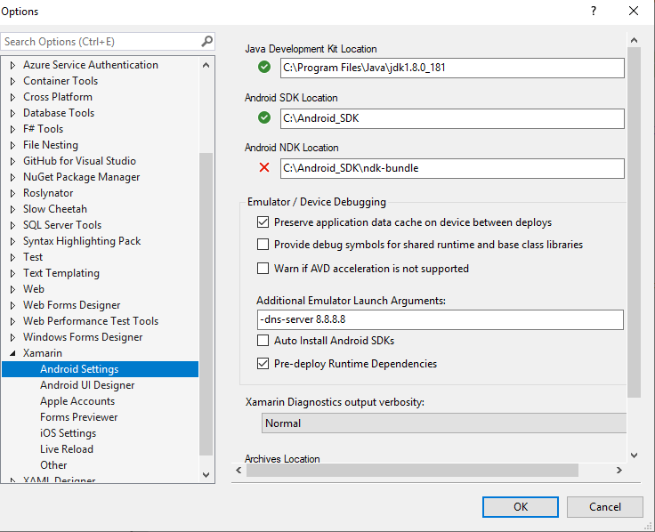

The [Android Emulator](https://developer.android.com/studio/run/emulator) is pretty sweet now. Fairly performant, [works with Hyper-V](/content/posts/3-xamarin-and-hyper-v/index.md) still enabled, etc.  
Recently I started having an issue where the emulator wouldn't get it's network set up properly. My adapter list looks pretty crazy (15 or so adapters), so maybe it's getting confused? Anyway, seems to be an issue that others have come across as well, because I found a few StackOverflow issues about it.
<!--more-->  

Basically, it boils down to the emulator using the wrong DNS, whether it's misconfigured or being blocked I'm not sure. 
So when starting the emulator, set the DNS with `-dns-server 8.8.8.8` or whatever DNS you'd like.  

Running through the command line, `emulator.exe -avd <avdname> -dns-server 8.8.8.8`.  

If you use the emulator with Visual Studio (Xamarin for example), you can pass this to the emulator by going: `Tools --> Xamarin --> Android Settings` and setting the `Additional Emulator Launch Arguments`.
  