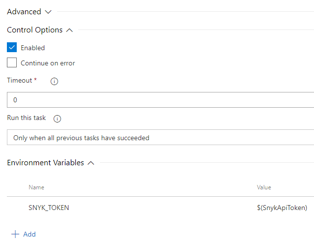
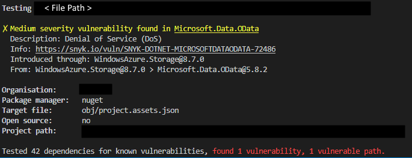

[Snyk](https://snyk.io/) is an open source tool for checking project packages for vulnerabilities. It currently checks the main package sources like npm and Nuget.  While it has many integrations with source control (github, bitbucket, etc), there's no VSTS build pipeline integration yet.  
As such, I've gone and used the API instead!  It was fairly straightforward to set up, which is good for the safety of our clients.  

**tl;dr**  

- Setup Snyk account and get API key
- Setup pipeline with SNYK_TOKEN (api key)  
- Have task to install Snyk and run `snyk test` 
 
<!--more-->  

   

# Snyk setup  

*EDIT:* As noted by a colleague, there are different [pricing plans](https://snyk.io/plans) and the free may not suit all situations.

- Create Snyk account  
  - *NOTE: Only Github, Bitbucket, and Google accounts supported at time of writing i.e. MUST have one of these to continue :(*  
- Go to Account Settings  
- Show and copy the API key  

     

# Pipeline setup  

- In VSTS (Azure DevOps now, so ADOps?)  
  - Create new variable in pipeline for the API key  
  - Add new steps to build pipeline (I used these 3)
  
    - *NOTE: The environment variable is **key** here, explained later*  

    - **First step** installs Snyk to the Agent: `npm install -g snyk`  
    - **Second step** performs the Snyk checks on the npm packages: `snyk test`  
    - **Third step** performs Snyk checks on Nuget packages (different folder, so different task): `snyk test --file=slnname.sln`  
      - *NOTE: These two tasks have different working directories set as these checks must be run in the directory with the package file*
      - *Also note: The extra *file* parameter there as Snyk currently doesn't support sln detection.  
   

# Output
### Safe  
  

### Vulnerable  
  

## Some Explanations  
Snyk requires authentication, but if the environment variable **SNYK_TOKEN** is present, it's used automatically as the authentication key. As such, ALL commands you want to run with Snyk will require this environment variable set.    
The `snyk test` command must be run from a directory containing a package manangement file (package.json, packages.config, etc)  
The full list of supported package managers is on their website, but it's quite extensive.  

Some other things to note:  
- If a vulnerability is detected, the build steps above fail (by default)  
- Due to the above, I've got the steps set to "Continue on Fail" since if the first one fails, I'd not know if the second also has vulnerabilities until it fails on the next build.  

# Happy Snyking!!